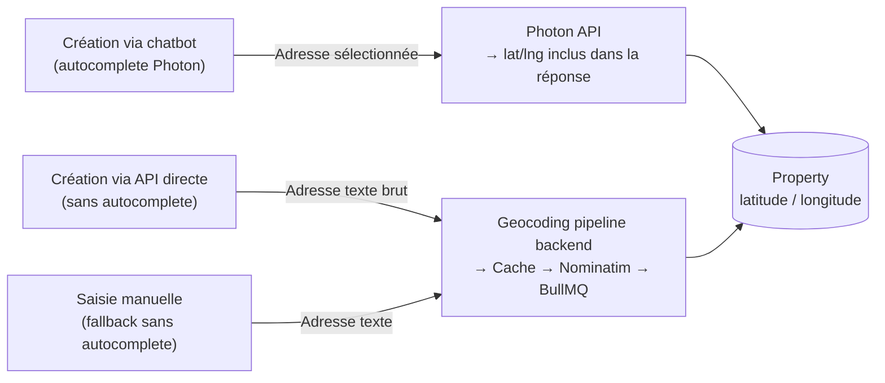
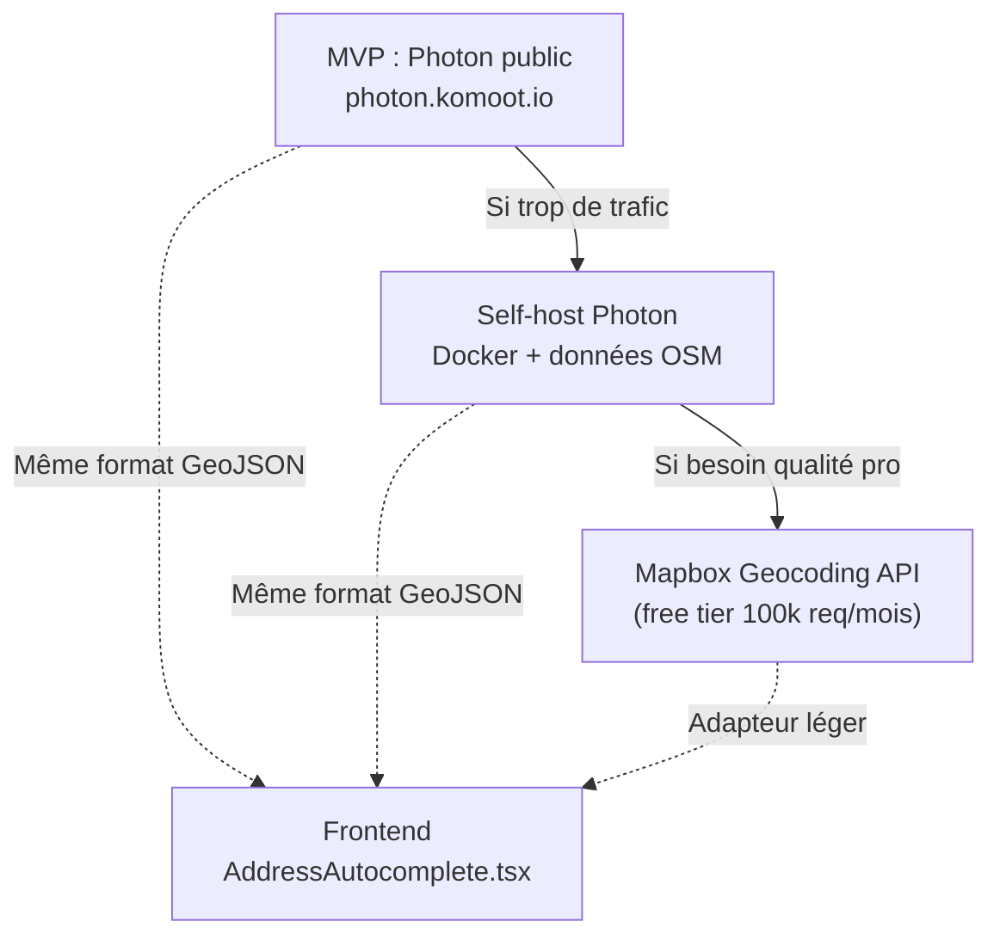
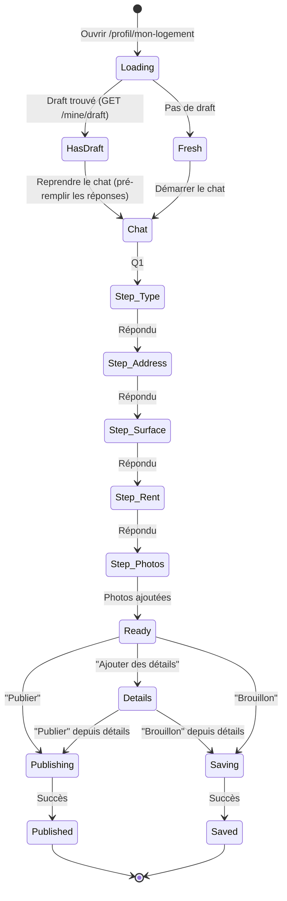
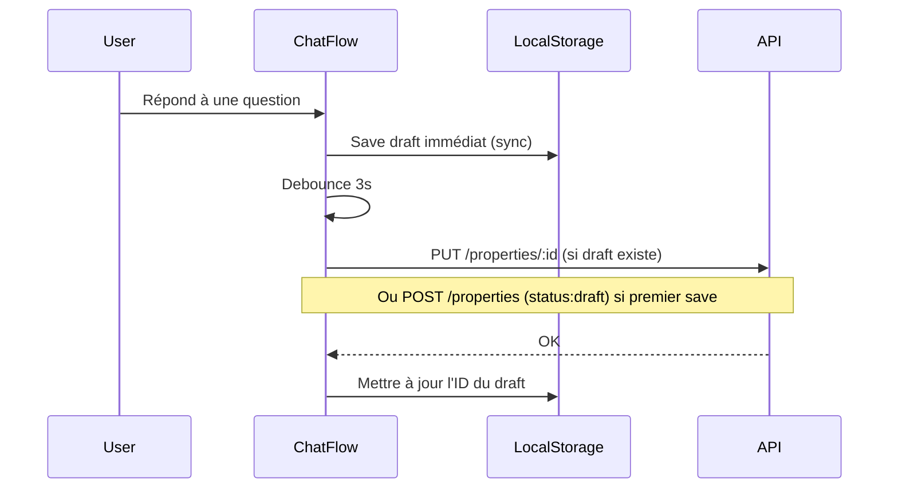

# Flow de création d'annonce — Plan définitif

> **Date :** 30 mars 2026
> **Auteur :** Abderrazaq
> **Statut :** Plan validé — en attente d'implémentation
> **Flow choisi :** Conversationnel (chatbot-style)

---

## 1. Vision

L'utilisateur décrit son logement en répondant à un chatbot.
Chaque question apparaît une par une. Les réponses s'empilent comme dans une conversation.
L'effet "IA qui te guide" fait sensation, même si les questions sont pré-codées.

**Pourquoi ce flow :**
- Zéro surcharge cognitive — une seule question à la fois
- Engagement maximal — le format chat est natif mobile
- Identité SwitchAppart unique — aucun concurrent immo ne fait ça
- Réutilisable — le composant chatbot pourra servir pour l'onboarding, les préférences, etc.

---

## 2. Le chatbot en détail

### 2.1 Structure générale

```mermaid
flowchart TD
    START([User clique "Décrire mon logement"]) --> INTRO

    INTRO["🤖 <b>Message d'accueil</b><br/>'Salut ! Je vais vous aider à décrire<br/>votre logement en quelques questions.<br/>Ça prend moins de 2 minutes !'"]
    
    INTRO --> Q1

    Q1["🤖 <b>Quel type de logement ?</b><br/>─────────────────<br/>Chips tactiles :<br/>🏢 Appartement · 🏠 Maison<br/>🛋️ Studio · 🏗️ Loft · 🛏️ Chambre"]
    
    Q1 -->|User tape un chip| R1["✅ Appartement"]
    R1 --> Q2

    Q2["🤖 <b>Où se trouve-t-il ?</b><br/>─────────────────<br/>Input adresse avec autocomplete<br/>(Photon — worldwide)<br/>Suggestions en temps réel<br/>Sélection → pré-remplit :<br/>ville, code postal, pays, quartier, lat/lng"]
    
    Q2 -->|User sélectionne une adresse| R2["✅ 12 rue de la Paix<br/>75002 Paris, France 🇫🇷"]
    R2 --> Q3

    Q3["🤖 <b>Quelle surface et combien de pièces ?</b><br/>─────────────────<br/>Surface : input m² (clavier numérique)<br/>Pièces : stepper compact (- 3 +)"]
    
    Q3 -->|User remplit| R3["✅ 45m² · 3 pièces"]
    R3 --> Q4

    Q4["🤖 <b>Quel loyer par mois ?</b><br/>─────────────────<br/>Input € (clavier numérique)<br/>Placeholder: 'ex: 1 200'"]
    
    Q4 -->|User saisit| R4["✅ 1 200 €/mois"]
    R4 --> Q5

    Q5["🤖 <b>Montrez-nous votre logement !</b><br/>'Les photos font toute la différence<br/>pour trouver votre Switch.'<br/>─────────────────<br/>Zone upload / bouton Camera<br/>Min 1, max 10<br/>Grid preview avec drag-to-reorder<br/>Badge 'Couverture' sur la 1ère"]
    
    Q5 -->|Photos ajoutées| R5["✅ 4 photos ajoutées"]
    R5 --> READY

    READY["🤖 🎉 <b>Votre logement est prêt !</b><br/>'Vous pouvez publier maintenant<br/>ou ajouter quelques détails pour<br/>booster votre score de compatibilité.'<br/>─────────────────<br/>[✨ Publier mon logement]<br/>[📝 Ajouter des détails]<br/>[💾 Sauvegarder en brouillon]"]

    READY -->|Publier| PUB
    READY -->|Détails| DETAILS
    READY -->|Brouillon| DRAFT

    DETAILS --> DETAIL_FLOW
    DETAIL_FLOW["🤖 <b>Quelques détails en plus</b><br/>'Plus votre annonce est complète,<br/>plus vous matcherez !'<br/>─────────────────<br/>Chambres (stepper) · SdB (stepper)<br/>Description (textarea, placeholder IA)<br/>Équipements (toggles grid)<br/>DPE (A→G slider) · GES (A→G slider)<br/>Meublé · Animaux · Fumeur (toggles)<br/>Dépôt € · Charges comprises (toggle)<br/>Dispo : date début / fin<br/>─────────────────<br/>[✨ Publier] [💾 Brouillon]"]
    
    DETAIL_FLOW -->|Publier| PUB
    DETAIL_FLOW -->|Brouillon| DRAFT

    PUB([✅ Publié !<br/>'Votre logement est maintenant visible.<br/>Commencez à swiper pour<br/>trouver votre Switch !'<br/>─────────────────<br/>[🔄 Aller swiper] [👤 Mon profil]])

    DRAFT[(💾 Brouillon sauvé<br/>'Vous pourrez reprendre<br/>à tout moment depuis votre profil.'<br/>─────────────────<br/>[👤 Mon profil])]
    
    DRAFT -->|Reprendre plus tard| INTRO
```

### 2.2 Détail de chaque question

#### Q1 — Type de logement

```
┌─────────────────────────────────────┐
│  🤖  Quel type de logement         │
│      proposez-vous ?                │
│                                     │
│  ┌──────────────┐ ┌──────────────┐  │
│  │ 🏢 Appartement│ │ 🏠 Maison    │  │
│  └──────────────┘ └──────────────┘  │
│  ┌──────────────┐ ┌──────────────┐  │
│  │ 🛋️ Studio     │ │ 🏗️ Loft      │  │
│  └──────────────┘ └──────────────┘  │
│  ┌──────────────┐                   │
│  │ 🛏️ Chambre    │                   │
│  └──────────────┘                   │
└─────────────────────────────────────┘
```

- **Interaction :** 1 tap sur un chip
- **Validation :** sélection obligatoire
- **Mapping API :** `appartement→apartment`, `maison→house`, `studio→studio`, `loft→loft`, `chambre→room`
- **Après sélection :** le chip sélectionné s'ancre comme réponse, la question suivante apparaît avec une animation slide-up

#### Q2 — Adresse (avec autocomplete + geocoding)

```
┌─────────────────────────────────────┐
│  🤖  Où se trouve votre logement ?  │
│                                     │
│  ┌─────────────────────────────┐    │
│  │ 🔍 12 rue de la pa...       │    │
│  └─────────────────────────────┘    │
│                                     │
│  Suggestions :                      │
│  ┌─────────────────────────────┐    │
│  │ 🇫🇷 12 Rue de la Paix       │    │
│  │    75002 Paris, France      │    │
│  ├─────────────────────────────┤    │
│  │ 🇫🇷 12 Rue de la Paix       │    │
│  │    69001 Lyon, France       │    │
│  ├─────────────────────────────┤    │
│  │ 🇧🇪 12 Rue de la Paix       │    │
│  │    1000 Bruxelles, Belgique │    │
│  └─────────────────────────────┘    │
│                                     │
│  💡 Pas d'adresse précise ?         │
│     [Saisir juste la ville →]       │
└─────────────────────────────────────┘
```

- **Interaction :** L'user tape → suggestions en temps réel (debounce 300ms) → tap sur une suggestion
- **Source :** Photon (komoot.io) — gratuit, sans clé API, worldwide, basé sur OpenStreetMap
- **Pré-remplissage auto :** quand l'user sélectionne une adresse, on extrait :
  - `address` (rue + numéro)
  - `city` (ville)
  - `postal_code` (code postal)
  - `country` (pays)
  - `district` (arrondissement si applicable, ex: "2e" pour Paris 75002)
  - `latitude` / `longitude` (coordonnées GPS)
- **Fallback "juste la ville" :** lien discret en bas, ouvre un input simple ville (pour les users qui ne veulent pas donner leur adresse exacte). Dans ce cas, le geocoding se fait sur la ville seule.
- **Après sélection :** preview card avec les infos extraites + drapeau pays, confirmable en 1 tap

```
┌─────────────────────────────────────┐
│  ✅  Adresse confirmée              │
│                                     │
│  ┌─────────────────────────────┐    │
│  │ 📍 12 Rue de la Paix        │    │
│  │    75002 Paris · 2e arr.    │    │
│  │    🇫🇷 France                │    │
│  │    ┌──────────────────┐     │    │
│  │    │ 🗺️ Mini-map preview │     │    │
│  │    └──────────────────┘     │    │
│  └─────────────────────────────┘    │
│                                     │
│  [✏️ Modifier]  [Confirmer ✓]       │
└─────────────────────────────────────┘
```

#### Q3 — Surface et pièces

```
┌─────────────────────────────────────┐
│  🤖  Quelle surface et combien     │
│      de pièces ?                    │
│                                     │
│  Surface                            │
│  ┌─────────────────────────────┐    │
│  │              45          m² │    │
│  └─────────────────────────────┘    │
│                                     │
│  Pièces                             │
│  ┌───┐  ┌─────┐  ┌───┐             │
│  │ − │  │  3  │  │ + │             │
│  └───┘  └─────┘  └───┘             │
│                                     │
│  [Continuer →]                      │
└─────────────────────────────────────┘
```

- **Interaction :** saisie m² (clavier numérique natif) + stepper pour pièces
- **Validation :** surface > 0, pièces >= 1
- **Les deux sur le même écran** car ce sont des chiffres rapides à saisir ensemble

#### Q4 — Loyer

```
┌─────────────────────────────────────┐
│  🤖  Quel loyer mensuel ?          │
│                                     │
│  ┌─────────────────────────────┐    │
│  │           1 200           € │    │
│  └─────────────────────────────┘    │
│  charges non comprises              │
│                                     │
│  [Continuer →]                      │
└─────────────────────────────────────┘
```

- **Interaction :** saisie € (clavier numérique)
- **Validation :** loyer >= 0
- **Note "charges non comprises"** : les charges sont dans les détails optionnels

#### Q5 — Photos

```
┌─────────────────────────────────────┐
│  🤖  Montrez-nous votre            │
│      logement !                     │
│      Les photos font toute la       │
│      différence pour trouver        │
│      votre Switch.                  │
│                                     │
│  ┌─────────────────────────────┐    │
│  │                             │    │
│  │     📷 Ajouter des photos   │    │
│  │     ou glissez-les ici      │    │
│  │                             │    │
│  └─────────────────────────────┘    │
│                                     │
│  ┌────┐ ┌────┐ ┌────┐ ┌────┐       │
│  │ 📷 │ │ 📷 │ │ 📷 │ │ 📷 │       │
│  │COVR│ │    │ │    │ │    │       │
│  └────┘ └────┘ └────┘ └────┘       │
│  ↕️ Drag pour réorganiser           │
│                                     │
│  [Continuer →]                      │
└─────────────────────────────────────┘
```

- **Interaction :** tap pour upload (galerie + camera) ou drag & drop (desktop)
- **Validation :** min 1 photo
- **1ère photo = couverture** (badge visuel), réorganisable par drag
- **Max 10 photos**, compteur visible
- **Upload immédiat** : chaque photo est uploadée vers MinIO dès l'ajout (pas à la fin), avec une progress bar par photo

#### Message final — Prêt à publier

```
┌─────────────────────────────────────┐
│  🤖  🎉 Votre logement est prêt !  │
│                                     │
│  Récap :                            │
│  ┌─────────────────────────────┐    │
│  │ 🏢 Appartement 45m²         │    │
│  │ 📍 Paris 2e, France · 3 pièces│    │
│  │ 💰 1 200 €/mois             │    │
│  │ 📷 4 photos                 │    │
│  └─────────────────────────────┘    │
│                                     │
│  Vous pouvez publier maintenant     │
│  ou ajouter des détails pour        │
│  booster votre compatibilité.       │
│                                     │
│  ┌─────────────────────────────┐    │
│  │  ✨ Publier mon logement     │    │
│  └─────────────────────────────┘    │
│  ┌─────────────────────────────┐    │
│  │  📝 Ajouter des détails      │    │
│  └─────────────────────────────┘    │
│  ┌─────────────────────────────┐    │
│  │  💾 Sauvegarder le brouillon │    │
│  └─────────────────────────────┘    │
└─────────────────────────────────────┘
```

#### Section détails (optionnelle)

Si l'user clique "Ajouter des détails", on sort du format chat pour afficher un écran formulaire classique (scrollable) avec toutes les options :

```
┌─────────────────────────────────────┐
│  📝 Complétez votre annonce         │
│  ━━━━━━━━━━━━━━━━━━━━━━━━━━━━━     │
│  Barre progression : ██████░░ 65%   │
│                                     │
│  ▸ Description                      │
│    Textarea (placeholder:           │
│    "Décrivez l'ambiance, le         │
│    quartier, les transports...")     │
│                                     │
│  ▸ Pièces détaillées                │
│    Chambres (stepper)               │
│    Salles de bain (stepper)         │
│                                     │
│  ▸ Énergie                          │
│    DPE : [A][B][C][D][E][F][G]      │
│    GES : [A][B][C][D][E][F][G]      │
│                                     │
│  ▸ Équipements                      │
│    Grid de toggles (wifi, parking,  │
│    clim, TV, lave-linge, etc.)      │
│                                     │
│  ▸ Conditions                       │
│    Meublé (toggle)                  │
│    Animaux acceptés (toggle)        │
│    Fumeur autorisé (toggle)         │
│                                     │
│  ▸ Financier                        │
│    Dépôt de garantie (input €)      │
│    Charges comprises (toggle)       │
│                                     │
│  ▸ Disponibilité                    │
│    Date début (datepicker)          │
│    Date fin (datepicker, optionnel) │
│                                     │
│  ━━━━━━━━━━━━━━━━━━━━━━━━━━━━━     │
│  [✨ Publier] [💾 Brouillon]         │
└─────────────────────────────────────┘
```

---

## 3. Adresse autocomplete — Spécification technique

### 3.1 Stratégie : worldwide dès le départ

SwitchAppart commence en France mais vise l'Europe puis le monde entier.
L'autocomplete d'adresse doit fonctionner partout, pas juste en France.

### 3.2 API utilisée — Photon (par Komoot)

**Photon** — `photon.komoot.io`
- Gratuit, sans clé API, sans inscription
- Basé sur OpenStreetMap — couverture mondiale
- Retourne : adresse structurée + coordonnées GPS
- Rapide, conçu pour l'autocomplete
- Self-hostable si besoin de scale (Docker image dispo)

**Pourquoi Photon et pas les autres :**

| Solution | Gratuit | Worldwide | Sans clé API | Autocomplete | Verdict |
|---|---|---|---|---|---|
| **Photon (Komoot)** | ✅ | ✅ | ✅ | ✅ | **Choix retenu** |
| api-adresse.data.gouv.fr | ✅ | ❌ France only | ✅ | ✅ | Trop limité |
| Nominatim (OSM) | ✅ | ✅ | ✅ | ⚠️ Lent, 1 req/s | Rate limit trop bas pour autocomplete |
| Mapbox Geocoding | ⚠️ Free tier | ✅ | ❌ Clé requise | ✅ | Plan B si Photon scale pas |
| Google Places | ❌ Payant | ✅ | ❌ Clé requise | ✅ | Trop cher pour un MVP |

**Plan d'évolution :**
- MVP → Photon public (`photon.komoot.io`)
- Scale → Self-host Photon (Docker) ou migration vers Mapbox
- Les deux retournent du GeoJSON, le switch est transparent côté frontend

### 3.3 Endpoint

```
GET https://photon.komoot.io/api/?q={query}&limit=5&lang=fr
```

**Paramètres :**
| Param | Valeur | Description |
|---|---|---|
| `q` | texte saisi | La recherche de l'utilisateur |
| `limit` | 5 | Nombre de suggestions |
| `lang` | `fr` | Langue des résultats (adapté à la locale de l'user) |
| `lat` | optionnel | Latitude de bias (favorise les résultats proches) |
| `lon` | optionnel | Longitude de bias |
| `bbox` | optionnel | Bounding box pour restreindre (ex: Europe) |

**Bias géographique :** on envoie les coordonnées du navigateur (si autorisées) ou le centre de l'Europe par défaut pour prioriser les résultats pertinents.

### 3.4 Réponse (GeoJSON)

```json
{
  "type": "FeatureCollection",
  "features": [
    {
      "properties": {
        "name": "Rue de la Paix",
        "housenumber": "12",
        "street": "Rue de la Paix",
        "postcode": "75002",
        "city": "Paris",
        "state": "Île-de-France",
        "country": "France",
        "countrycode": "FR",
        "type": "house",
        "osm_key": "building"
      },
      "geometry": {
        "type": "Point",
        "coordinates": [2.331, 48.869]
      }
    }
  ]
}
```

### 3.5 Extraction des champs

Quand l'user sélectionne une suggestion, on extrait :

| Champ SwitchAppart | Source Photon | Exemple FR | Exemple ES |
|---|---|---|---|
| `address` | `housenumber` + `street` | "12 Rue de la Paix" | "15 Calle Gran Vía" |
| `city` | `properties.city` | "Paris" | "Madrid" |
| `postal_code` | `properties.postcode` | "75002" | "28013" |
| `country` | `properties.country` | "France" | "Spain" |
| `country_code` | `properties.countrycode` | "FR" | "ES" |
| `state` | `properties.state` | "Île-de-France" | "Comunidad de Madrid" |
| `district` | Déduit (voir logique ci-dessous) | "2e arr." | "" |
| `latitude` | `geometry.coordinates[1]` | 48.869 | 40.420 |
| `longitude` | `geometry.coordinates[0]` | 2.331 | -3.703 |

**Logique district (pays-specific) :**
- **France** — Paris : `75002` → "2e arr." / Lyon : `69003` → "3e arr." / Marseille : `13001` → "1er arr."
- **Autres pays** : `district` = `properties.district` si présent dans Photon, sinon vide
- L'user peut toujours saisir/modifier le district manuellement

**Affichage suggestion :**
Le label de chaque suggestion est construit : `"{housenumber} {street}, {postcode} {city}, {country}"`
Avec le drapeau emoji du pays (déduit de `countrycode`) : 🇫🇷 🇪🇸 🇩🇪 🇮🇹 🇧🇪 etc.

### 3.6 Fallback "Juste la ville"

Si l'user ne veut pas donner son adresse exacte :
- Même API Photon mais avec filtre `osm_tag=place:city` ou `place:town`
- `GET https://photon.komoot.io/api/?q={query}&limit=5&lang=fr&osm_tag=place:city`
- On récupère : `city`, `country`, `postal_code`, `latitude`, `longitude` (centre-ville)
- `address` reste vide

### 3.7 Saisie manuelle (dernier recours)

Si l'API ne trouve pas ou si l'user préfère saisir manuellement :
- Lien "Saisir manuellement" en bas des suggestions
- Affiche 4 inputs classiques : Adresse, Ville, Code postal, Pays (dropdown)
- Dans ce cas, pas de lat/lng depuis le frontend → le backend geocode via le pipeline existant (cache → Nominatim → BullMQ)

### 3.8 Debounce et UX

- **Debounce :** 300ms après la dernière frappe
- **Min caractères :** 3 avant de déclencher la recherche
- **Loading state :** spinner discret dans l'input
- **Aucun résultat :** message "Adresse non trouvée" + lien "Saisir manuellement"
- **Géolocalisation optionnelle :** si le navigateur fournit la position, on l'envoie en `lat`/`lon` pour biaiser les résultats vers la zone de l'user

---

## 4. Geocoding — Architecture

### 4.1 Deux sources de coordonnées



**Principe :**
- Si l'user passe par l'autocomplete Photon → les coordonnées sont déjà dans la réponse, le frontend les envoie au backend
- Si l'adresse arrive en texte brut (saisie manuelle, API directe, import) → le pipeline geocoding backend existant prend le relais (cache → Nominatim → BullMQ worker)

### 4.2 Pas de double travail

Le pipeline geocoding qu'on a déjà construit (`backend/src/modules/geocoding/`) reste en place pour :
- Les propriétés créées via saisie manuelle (sans autocomplete)
- Le backfill des anciennes propriétés
- Les modifications d'adresse en texte brut
- Les créations via API directe (admin, import, etc.)

L'autocomplete **Photon** est une **optimisation frontend** : on récupère les coordonnées gratuitement au moment de la saisie, donc on évite un call Nominatim côté backend.

### 4.3 Scaling futur



Le switch entre providers est transparent côté frontend car Photon et le self-host utilisent le même format GeoJSON. Si on migre vers Mapbox, un petit adapteur dans `address.service.ts` normalise la réponse.

---

## 5. Backend — Endpoints nécessaires

### 5.1 Endpoints existants (déjà implémentés)

| Méthode | Route | Description |
|---|---|---|
| `POST` | `/api/v1/properties` | Créer une propriété |
| `PUT` | `/api/v1/properties/:id` | Mettre à jour une propriété |
| `GET` | `/api/v1/properties/:id` | Récupérer une propriété |
| `GET` | `/api/v1/properties/mine` | Mes propriétés |

### 5.2 Endpoints à créer

| Méthode | Route | Description | Détails |
|---|---|---|---|
| `POST` | `/api/v1/uploads/property-photos` | Upload photos vers MinIO | Auth requis. Multipart form-data. Retourne les URLs + paths. Max 10 photos, max 10Mo/photo. |
| `PATCH` | `/api/v1/properties/:id/publish` | Publier un brouillon | Change `status: "draft"` → `"published"`, `published: true`. Valide que le minimum est rempli. |
| `GET` | `/api/v1/properties/mine/draft` | Récupérer mon brouillon | Retourne le brouillon actif (status = "draft") ou 404. Un user = un brouillon max. |

### 5.3 Modifications aux endpoints existants

**`POST /api/v1/properties` — Accepter les brouillons :**
- Nouveau champ optionnel : `status: "draft" | "published"` (défaut : `"published"`)
- Si `status: "draft"` → validation allégée (seuls les champs fournis sont validés)
- Si `status: "published"` → validation complète (type, city, surface, rooms, rent, min 1 photo)

**`PUT /api/v1/properties/:id` — Accepter lat/lng du frontend :**
- Nouveaux champs optionnels : `latitude`, `longitude`
- Si fournis (venant de l'autocomplete) → stocker directement, pas de geocoding
- Si non fournis mais adresse modifiée → pipeline geocoding existant

### 5.4 Schéma Zod mis à jour

```
createPropertySchema (mode published) :
  title        : string (optionnel, auto-généré si absent)
  property_type: enum [apartment, studio, house, loft, room] (requis)
  city         : string min 1 (requis)
  surface_area : int > 0 (requis)
  rooms        : int >= 1 (requis)
  monthly_rent : int >= 0 (requis)
  photos       : string[] min 1 (requis) — URLs MinIO
  
  + tous les champs optionnels existants
  + latitude / longitude (optionnels, float)
  + dpe_rating : enum [A,B,C,D,E,F,G] (optionnel)
  + ges_rating : enum [A,B,C,D,E,F,G] (optionnel)

createPropertySchema (mode draft) :
  Tous les champs optionnels
  Aucune validation de minimum
```

---

## 6. Frontend — Architecture composants

### 6.1 Arborescence

```
frontend/src/app/profil/mon-logement/
├── page.tsx                          # Point d'entrée, gère draft loading + routing
├── components/
│   ├── ChatFlow.tsx                  # Conteneur chat principal (scroll, messages, animations)
│   ├── ChatMessage.tsx               # Bulle de message (bot ou user)
│   ├── ChatInputType.tsx             # Input Q1 : chips type de bien
│   ├── ChatInputAddress.tsx          # Input Q2 : autocomplete adresse + preview
│   ├── ChatInputSurface.tsx          # Input Q3 : surface + pièces
│   ├── ChatInputRent.tsx             # Input Q4 : loyer
│   ├── ChatInputPhotos.tsx           # Input Q5 : upload photos
│   ├── ChatReadyMessage.tsx          # Message final : récap + actions
│   ├── DetailForm.tsx                # Formulaire détails optionnels (post-chat)
│   ├── AddressAutocomplete.tsx       # Composant autocomplete Photon (worldwide)
│   ├── AddressPreview.tsx            # Preview carte + infos extraites
│   ├── DpeSelector.tsx               # Sélecteur DPE A→G avec couleurs
│   └── GesSelector.tsx               # Sélecteur GES A→G avec couleurs
├── hooks/
│   ├── useCreateProperty.ts          # Mutation TanStack : POST /properties
│   ├── useUpdateProperty.ts          # Mutation TanStack : PUT /properties/:id
│   ├── usePublishProperty.ts         # Mutation TanStack : PATCH /properties/:id/publish
│   ├── useUploadPhotos.ts            # Mutation TanStack : POST /uploads/property-photos
│   ├── useMyDraft.ts                 # Query TanStack : GET /properties/mine/draft
│   └── useAddressSearch.ts           # Query TanStack : Photon autocomplete (debounced)
├── services/
│   ├── property-mutation.service.ts  # Appels API create/update/publish
│   ├── upload.service.ts             # Appels API upload photos
│   └── address.service.ts            # Appels Photon API (worldwide geocoding)
├── types/
│   └── listing.types.ts              # ListingDraft, ChatStep, AddressSuggestion, etc.
└── constants/
    └── listing.constants.ts          # Steps, property types mapping FR→EN, messages bot
```

### 6.2 Composant chatbot — Logique



### 6.3 Auto-save



- **localStorage** : sauvegarde immédiate à chaque réponse (protection contre crash/fermeture)
- **API** : sync toutes les 3 secondes (debounced) pour persister côté serveur
- **Reprise** : au chargement, on check d'abord l'API (`GET /mine/draft`), puis localStorage en fallback

---

## 7. Animations et UX

### 7.1 Transitions entre questions

- Nouvelle question : **slide-up + fade-in** (300ms, ease-out)
- Réponse confirmée : la réponse se **collapse** en une ligne résumée avec une icône ✅
- Auto-scroll vers le bas à chaque nouvelle question
- L'input actif est toujours **en bas de l'écran** (au-dessus du clavier sur mobile)

### 7.2 Indicateurs visuels

- **Bot avatar** : petit icône SwitchAppart à gauche de chaque message bot
- **Typing indicator** : 3 dots animés avant chaque question du bot (300ms delay pour l'effet)
- **Réponses user** : alignées à droite, fond coloré (brand-cyan/purple gradient)
- **Messages bot** : alignés à gauche, fond gris clair

### 7.3 Photo upload

- Chaque photo : progress bar individuelle pendant l'upload
- Preview en grid (3 colonnes)
- Badge "Couverture" sur la première
- Bouton X pour supprimer
- Drag & drop pour réorganiser (desktop) / long-press pour réorganiser (mobile)

### 7.4 Address preview

- Quand l'user sélectionne une adresse → mini carte Leaflet (150px de haut)
- Pin sur les coordonnées
- Infos extraites sous la carte (ville, CP, quartier)
- Bouton "Modifier" pour revenir à l'input

---

## 8. Brouillon et enrichissement post-publication

### 8.1 Accès au brouillon

- **Profil** → section "Mon logement"
  - Si brouillon : "Reprendre ma description" → rouvre le chatbot avec les réponses pré-remplies
  - Si publié : "Mon logement" → page de gestion (modifier, stats, score compatibilité)
  - Si rien : "Décrire mon logement" → chatbot vierge

### 8.2 Enrichissement post-publication

Accessible depuis **Profil → Mon logement → Compléter** :

- Barre de progression : "Votre annonce est complète à X%"
- Chaque section a un état : ✅ Rempli / ⚪ À compléter
- Nudges contextuels :
  - "Ajoutez une description → +15% de compatibilité"
  - "Indiquez le DPE → les locataires éco-responsables vous trouveront"
  - "Ajoutez vos équipements → +20% de compatibilité"

### 8.3 Calcul du score de complétion

| Champ | Poids |
|---|---|
| Type + Ville + Surface + Pièces + Loyer | 40% (obligatoire, toujours rempli) |
| Photos (3+) | 15% (1 photo = 8%, 3+ = 15%) |
| Description (50+ chars) | 15% |
| Équipements (3+) | 10% |
| DPE | 5% |
| Chambres + SdB | 5% |
| Conditions (meublé, animaux, fumeur) | 5% |
| Disponibilité (dates) | 5% |

---

## 9. Route et navigation

| Élément | Avant (Steven) | Après |
|---|---|---|
| Route | `/profil/hote` | `/profil/mon-logement` |
| Menu profil | "Proposer votre logement" | "Mon logement" |
| Header desktop | "Proposer son logement" | "Mon logement" |
| ProposeModal CTA | "Proposer mon logement" | "Décrire mon logement" |
| ConnectionModal post-login | Ouvre ProposeModal | Ouvre ProposeModal (inchangé) |

---

## 10. Prisma — Champs à ajouter

```
model Property {
  // ... existants ...
  
  dpe_rating    String?   // A, B, C, D, E, F, G
  ges_rating    String?   // A, B, C, D, E, F, G
}
```

Le `status` existe déjà (`draft`, `published`, `unavailable`, `exchanged`).
Le `published` boolean existe aussi — il doit être cohérent avec `status`.

---

## 11. Résumé des tâches d'implémentation

### Backend
1. Migration Prisma : ajouter `dpe_rating`, `ges_rating`
2. Endpoint upload photos (`POST /uploads/property-photos`)
3. Endpoint publish brouillon (`PATCH /properties/:id/publish`)
4. Endpoint get draft (`GET /properties/mine/draft`)
5. Modifier `POST /properties` pour accepter `status: "draft"` + validation allégée
6. Modifier `PUT /properties` pour accepter `latitude`/`longitude` du frontend
7. Modifier Zod schemas pour DPE/GES + draft mode

### Frontend
8. Composant `AddressAutocomplete` + service `api-adresse.data.gouv.fr`
9. Composant `ChatFlow` + toutes les sous-composants d'input
10. Composants `DpeSelector` / `GesSelector`
11. Hooks TanStack (create, update, publish, upload, draft, address search)
12. Page `/profil/mon-logement` + route
13. `DetailForm` pour l'enrichissement optionnel
14. Auto-save (localStorage + API debounced)
15. Animations (slide-up, typing indicator, collapse réponses)
16. Modifier navigation (ProposeModal, menu profil, header) pour pointer vers `/profil/mon-logement`

### Transverse
17. Mapping types FR → EN dans les constants
18. Titre auto-généré dans le service backend
19. Score de complétion (calcul backend, affiché frontend)
