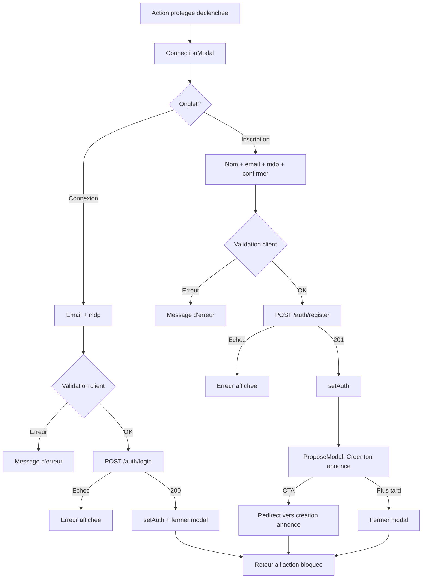
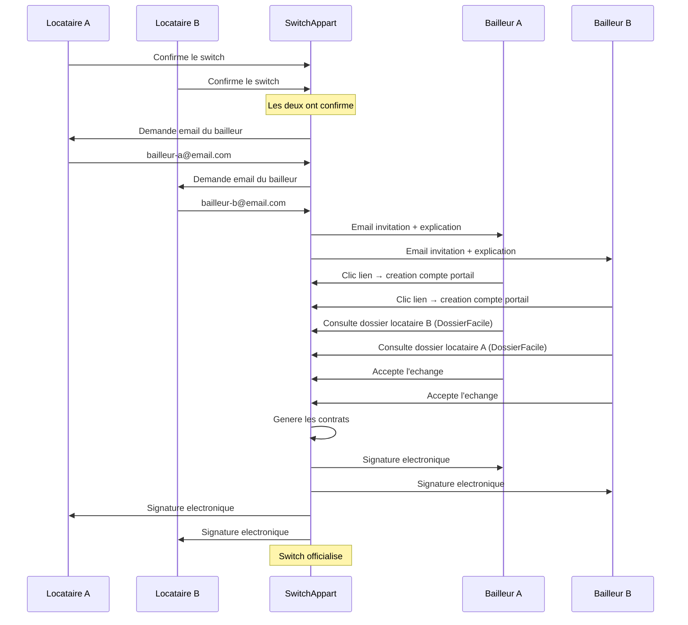
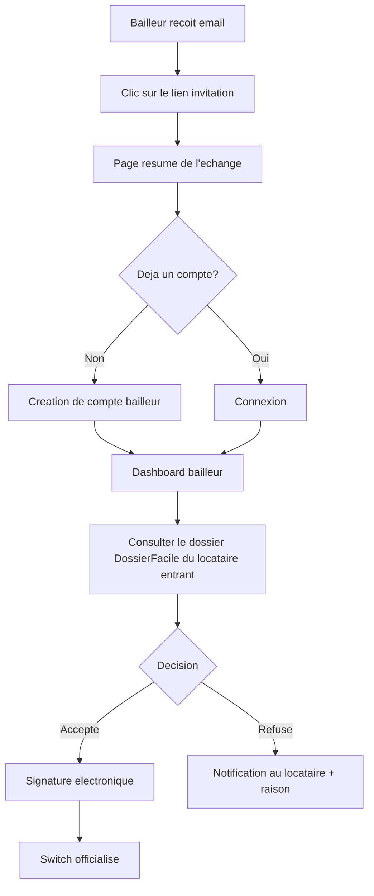
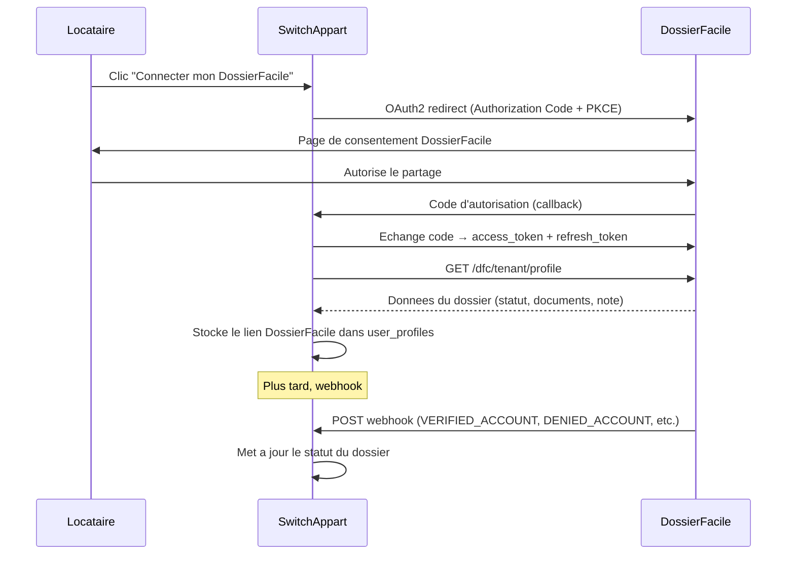
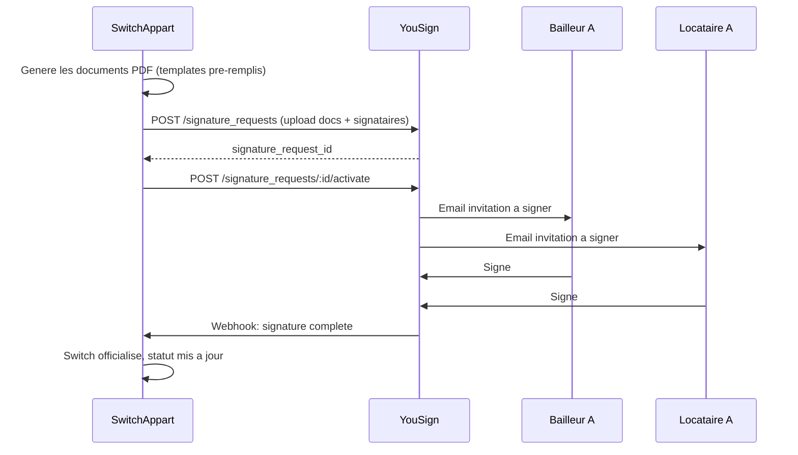
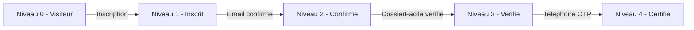

# Flow d'inscription, verification d'identite et anti-scam

> **Statut:** Draft v2 — Mars 2026
> **Auteur:** Abderrazaq
> **Derniere mise a jour:** 2026-03-30

---

## Table des matieres

1. [Modele de la plateforme](#1-modele-de-la-plateforme)
2. [Etat actuel et problemes](#2-etat-actuel-et-problemes)
3. [Flow d'inscription locataire](#3-flow-dinscription-locataire)
4. [Flow post-SwitchMatch: notification bailleur](#4-flow-post-switchmatch-notification-bailleur)
5. [Portail bailleur](#5-portail-bailleur)
6. [Integration DossierFacile](#6-integration-dossierfacile)
7. [Signature electronique (DocuSign / YouSign)](#7-signature-electronique-docusign--yousign)
8. [Systeme de niveaux de confiance](#8-systeme-de-niveaux-de-confiance)
9. [Verification d'identite — outils et comparatif](#9-verification-didentite--outils-et-comparatif)
10. [Anti-scam et anti-fraude](#10-anti-scam-et-anti-fraude)
11. [Login social (Google / Apple)](#11-login-social-google--apple)
12. [Changements backend](#12-changements-backend)
13. [Changements frontend](#13-changements-frontend)
14. [Phases d'implementation](#14-phases-dimplementation)

---

## 1. Modele de la plateforme

### Deux populations, deux interfaces

SwitchAppart met en relation des **locataires** entre eux. Les **bailleurs** (proprietaires) n'utilisent pas la plateforme au depart — ils sont contactes **apres** qu'un echange ait ete valide entre deux locataires.

```
+--------------------------------------------+
|          PLATEFORME SWITCHAPPART            |
|                                            |
|   +-----------+       +-----------+        |
|   | Locataire |       | Locataire |        |
|   |     A     |<----->|     B     |        |
|   +-----------+  SWIPE +-----------+       |
|        |          MATCH        |           |
|        v                       v           |
|   Mon appart             Son appart        |
|   (annonce)              (annonce)         |
+--------------------------------------------+
        |                       |
   SwitchMatch!            SwitchMatch!
        |                       |
        v                       v
   Email au               Email au
   bailleur A             bailleur B
        |                       |
        v                       v
+----------------+    +----------------+
| PORTAIL        |    | PORTAIL        |
| BAILLEUR A     |    | BAILLEUR B     |
| (espace dedie) |    | (espace dedie) |
+----------------+    +----------------+
```

### Parcours complet

1. **Locataire A** s'inscrit, cree son annonce (son logement actuel).
2. **Locataire B** s'inscrit, cree son annonce.
3. A et B se trouvent via le swipe → **SwitchMatch**.
4. Ils discutent par messagerie, visitent, se mettent d'accord.
5. Chacun entre l'email de son bailleur.
6. **SwitchAppart envoie un email** a chaque bailleur pour expliquer l'echange et l'inviter a creer son espace.
7. Chaque bailleur se connecte au **portail bailleur**, consulte le dossier du locataire entrant (via DossierFacile), et valide ou refuse l'echange.
8. Si les deux bailleurs acceptent → **signature electronique** du contrat (avenant au bail / resiliation + nouveau bail) via DocuSign ou YouSign.
9. Le switch est officialise.

### Qui s'inscrit ou?

| Utilisateur | Interface | Inscription |
|-------------|-----------|-------------|
| Locataire | App principale (PWA / React Native) | Formulaire classique (email + mdp + nom) |
| Bailleur | Portail bailleur (app separee, type admin) | Invitation par email apres un SwitchMatch, creation de compte via lien securise |

---

## 2. Etat actuel et problemes

### Ce qui existe

| Element | Statut | Problemes |
|---------|--------|-----------|
| Inscription email + mdp + nom | Fonctionnel | Pas de validation email (confirme automatiquement) |
| Login email + mdp | Fonctionnel | Pas de refresh token, session perdue au reload si localStorage vide |
| Boutons Google/Apple/Facebook | UI presente | Aucun handler, purement decoratif |
| Verification profil | Champ `verified` boolean | Jamais modifie, pas de pipeline |
| Anti-fraude | Aucun | Pas de rate limiting, pas de CAPTCHA, pas de blocage email jetable |
| `ProposeModal` post-inscription | S'affiche apres signup | Pousse vers la creation d'annonce mais ne guide pas le parcours |
| Portail bailleur | Inexistant | Rien n'existe cote bailleur |
| DossierFacile | Inexistant | Aucune integration |
| Signature electronique | Inexistant | Aucune integration |
| Notification bailleur post-match | Inexistant | Pas de flow pour contacter les bailleurs |

### Ecarts avec le PRD

- Le PRD mentionne `user_type` (tenant/buyer) — le concept est abandonne. Tous les inscrits sont des locataires. Les bailleurs ont leur propre portail.
- Le PRD prevoit un refresh token (P0) — pas implemente.
- Le PRD prevoit une confirmation email (P1) — contournee (`email_confirmed_at = now()` a l'inscription).
- Les images decoratives de `AuthFormHeader` et `DecorativeBubbles` viennent de CDN externes (interdit par CLAUDE.md).

---

## 3. Flow d'inscription locataire

### Champs collectes

Tout le monde est locataire. Pas de question de type. Trois champs a l'inscription:

| Champ | Obligatoire | Validation |
|-------|-------------|------------|
| Nom complet | Oui | 2-100 caracteres |
| Email | Oui | Format email valide, pas de domaine jetable |
| Mot de passe | Oui | Min 8 caracteres |
| Confirmer mot de passe | Oui (signup) | Egal au mot de passe |

### Diagramme du flow



### Regles de validation

**Client (formulaire)**

| Champ | Regle | Cle i18n |
|-------|-------|----------|
| Nom complet | Min 2 chars, max 100 | `auth.nameMinLength` |
| Email | Format email valide | `auth.invalidEmail` |
| Mot de passe | Min 8 chars | `auth.passwordMinLength` |
| Confirmer mdp | Egal au mot de passe | `auth.passwordMismatch` |
| Tous | Non vides | `auth.fillAllFields` |

**Serveur (Zod)**

```typescript
export const registerSchema = z.object({
  email: z.string().email().max(255).transform(v => v.toLowerCase().trim()),
  password: z.string().min(8).max(128),
  full_name: z.string().min(2).max(100).transform(v => v.trim()),
});
```

**Controles serveur supplementaires**

| Controle | Code erreur | HTTP |
|----------|------------|------|
| Email deja utilise | `AUTH_EMAIL_EXISTS` | 409 |
| Email jetable | `AUTH_DISPOSABLE_EMAIL` | 422 |
| Rate limit depasse | `RATE_LIMIT_EXCEEDED` | 429 |
| CAPTCHA invalide | `AUTH_CAPTCHA_FAILED` | 422 |

### Comportement post-inscription

1. `auth.users` + `user_profiles` + `user_switch_passes` crees.
2. `email_confirmed_at` reste **`null`** (plus de confirmation automatique).
3. Email de confirmation envoye (lien signe, expire 24h).
4. `ProposeModal` affiche (incite a creer l'annonce).
5. Banniere persistante tant que l'email n'est pas confirme.

---

## 4. Flow post-SwitchMatch: notification bailleur

### Declencheur

Quand deux locataires confirment leur volonte d'echanger (apres le match, la discussion, et la decision mutuelle), le flow bailleur se declenche.

### Diagramme



### Collecte de l'email du bailleur

**Quand:** Apres la double confirmation du switch (les deux locataires cliquent "Confirmer le switch").

**UI:** Un ecran dedie dans le flow de confirmation:

```
+--------------------------------------------------+
|                                                    |
|   Derniere etape avant de finaliser !              |
|                                                    |
|   Pour officialiser l'echange, nous devons         |
|   contacter votre proprietaire.                    |
|                                                    |
|   Email de votre bailleur:                         |
|   +------------------------------------------+    |
|   | bailleur@email.com                       |    |
|   +------------------------------------------+    |
|                                                    |
|   Nom du bailleur (optionnel):                     |
|   +------------------------------------------+    |
|   | M. Dupont                                |    |
|   +------------------------------------------+    |
|                                                    |
|   [info] Nous enverrons un email a votre           |
|   proprietaire pour lui expliquer la demarche      |
|   et l'inviter a valider l'echange.                |
|                                                    |
|          [ Envoyer l'invitation ]                  |
|                                                    |
+--------------------------------------------------+
```

### Email envoye au bailleur

**Objet:** Demande d'echange de logement — SwitchAppart

**Contenu:**
- Explication du concept SwitchAppart
- Nom du locataire actuel (celui qui part)
- Nom du locataire entrant (celui qui arrive)
- Lien vers le portail bailleur (avec token d'invitation)
- Lien vers le DossierFacile du locataire entrant
- Bouton CTA: "Consulter le dossier et valider"

### Donnees stockees

```prisma
model LandlordInvitation {
  id              String    @id @default(uuid())
  switch_id       String
  tenant_id       String    // le locataire qui a fourni cet email
  landlord_email  String
  landlord_name   String?
  token           String    @unique // token signe pour le lien d'invitation
  status          String    @default("pending") // pending | opened | accepted | refused | expired
  landlord_id     String?   // rempli quand le bailleur cree son compte
  sent_at         DateTime  @default(now())
  opened_at       DateTime?
  responded_at    DateTime?
  expires_at      DateTime  // 30 jours apres envoi

  @@map("landlord_invitations")
}
```

---

## 5. Portail bailleur

### Concept

Le portail bailleur est une **application separee** (comme le CRM admin). Le bailleur n'utilise jamais l'app principale. Il accede uniquement a un espace dedie pour gerer les demandes d'echange concernant son bien.

### Architecture

```
switchapp-/
  frontend/    — App locataire (PWA)
  admin/       — CRM admin (deja existant)
  landlord/    — Portail bailleur (NOUVEAU)
  backend/     — API partagee
```

Le portail bailleur est un Next.js separe, deploye sur un sous-domaine (`bailleur.switchappart.com`).

### Inscription bailleur

Le bailleur ne s'inscrit **pas de son propre chef**. Il recoit un email d'invitation avec un lien securise:

```
https://bailleur.switchappart.com/invitation?token=xxx
```

**Flow:**

1. Le bailleur clique sur le lien.
2. Il arrive sur une page qui resume l'echange propose.
3. Il cree son compte (email pre-rempli + mot de passe).
4. Il accede a son espace.



### Fonctionnalites du portail bailleur

| Fonctionnalite | Description |
|----------------|-------------|
| Dashboard | Vue d'ensemble des demandes d'echange en cours |
| Dossier locataire | Consultation du DossierFacile du locataire entrant |
| Validation/refus | Accepter ou refuser l'echange avec motif |
| Signature | Signer les documents electroniquement |
| Historique | Historique des echanges passes sur ce bien |
| Profil | Infos du bailleur + ses biens |
| Messagerie | Canal de communication avec SwitchAppart (support) |

### Donnees specifiques bailleur

```prisma
model Landlord {
  id              String    @id @default(uuid())
  email           String    @unique
  full_name       String?
  phone           String?
  company_name    String?   // si societe de gestion
  password_hash   String
  email_verified  Boolean   @default(false)
  created_at      DateTime  @default(now())
  updated_at      DateTime  @updatedAt

  @@map("landlords")
}

model LandlordProperty {
  id              String    @id @default(uuid())
  landlord_id     String
  property_id     String    // reference a l'annonce du locataire actuel
  is_owner        Boolean   @default(true)
  created_at      DateTime  @default(now())

  @@map("landlord_properties")
}
```

---

## 6. Integration DossierFacile

### Qu'est-ce que DossierFacile?

DossierFacile est le **dossier de location numerique de l'Etat** (Ministere de la Transition ecologique). Entierement gratuit, il permet aux locataires de constituer un dossier certifie contenant:

- Piece d'identite verifiee
- Justificatifs de revenus
- Justificatifs de domicile
- Garant(s) si applicable
- Avis d'imposition

Le dossier est **note et valide** par des operateurs DossierFacile. Un dossier valide = gage de confiance pour le bailleur.

### Pourquoi l'integrer?

1. **Confiance bailleur**: un bailleur qui recoit un dossier certifie par l'Etat sera bien plus enclin a accepter l'echange.
2. **Verification d'identite**: DossierFacile verifie deja la piece d'identite → ca remplace partiellement le KYC pour nos niveaux de confiance.
3. **Gratuit**: zero cout pour SwitchAppart et les utilisateurs.
4. **Credibilite**: association avec un service gouvernemental = confiance institutionnelle.

### Integration technique: DossierFacile Connect

DossierFacile fournit **DossierFacile Connect** (OAuth2 SSO). L'ancienne API Partenaire a ete decomissionnee en mars 2025.

**Principe:**
- Un bouton "Connecter mon DossierFacile" dans le profil du locataire.
- L'utilisateur se connecte a DossierFacile (ou cree un compte) et consent au partage.
- SwitchAppart recoit un access token pour consulter le profil locataire via l'API.
- Des webhooks notifient les changements de statut du dossier.



### Endpoints DossierFacile

| Endpoint | Usage |
|----------|-------|
| `GET /dfc/tenant/profile` | Recuperer les infos du dossier du locataire connecte |
| SSO Auth URL | `https://sso.dossierfacile.fr/auth/realms/dossier-facile/protocol/openid-connect/auth` |
| Token URL | `https://sso.dossierfacile.fr/auth/realms/dossier-facile/protocol/openid-connect/token` |

### Webhooks DossierFacile

| Event | Description | Action SwitchAppart |
|-------|-------------|---------------------|
| `VERIFIED_ACCOUNT` | Dossier valide par DossierFacile | `dossierfacile_status = "verified"` + badge vert |
| `DENIED_ACCOUNT` | Dossier refuse | `dossierfacile_status = "denied"` + notifier le locataire |
| `CREATED_ACCOUNT` | Dossier en cours | `dossierfacile_status = "pending"` |
| `DELETED_ACCOUNT` | Compte supprime | `dossierfacile_status = null` |
| `ACCESS_REVOKED` | Consentement revoque | Supprimer le lien |

### Donnees stockees

```prisma
model UserProfile {
  // ... champs existants ...

  dossierfacile_linked     Boolean   @default(false)
  dossierfacile_status     String?   // "pending" | "verified" | "denied"
  dossierfacile_url        String?   // URL du dossier a partager au bailleur
  dossierfacile_token      String?   // refresh token pour interroger l'API
  dossierfacile_linked_at  DateTime?
}
```

### Ou dans le parcours utilisateur?

| Moment | Obligatoire? | Contexte |
|--------|-------------|----------|
| Profil > Parametres | Non | Le locataire peut lier son DossierFacile a tout moment |
| Apres creation d'annonce | Encourage (banniere) | "Augmentez vos chances: liez votre DossierFacile" |
| Avant confirmation de switch | Obligatoire | Sans DossierFacile verifie, le switch ne peut pas etre confirme |
| Email au bailleur | Automatique | Le lien DossierFacile est inclus dans l'email d'invitation |

### Acces pour obtenir les credentials

1. Contacter l'equipe DossierFacile: `partenariat@dossierfacile.fr`
2. Fournir: URL de redirect, URL de webhook, contact technique
3. Recevoir: `client_id` + `client_secret` pour la preprod
4. Tester et valider
5. Passer en prod

---

## 7. Signature electronique (DocuSign / YouSign)

### Quand?

Apres que les deux bailleurs aient accepte l'echange, la plateforme genere les documents et les fait signer electroniquement par les 4 parties (2 locataires + 2 bailleurs).

### Documents a signer

| Document | Signataires | Description |
|----------|-------------|-------------|
| Avenant au bail A | Bailleur A + Locataire A | Resiliation du bail de A dans le logement A |
| Nouveau bail A | Bailleur A + Locataire B | Bail de B dans le logement A |
| Avenant au bail B | Bailleur B + Locataire B | Resiliation du bail de B dans le logement B |
| Nouveau bail B | Bailleur B + Locataire A | Bail de A dans le logement B |
| Accord d'echange | Locataire A + Locataire B | Accord mutuel d'echange |

### Comparatif providers

| Provider | Prix/signature | eIDAS | Avantages | Inconvenients |
|----------|---------------|-------|-----------|---------------|
| **YouSign** | ~0.50€ | Oui (avance) | Francais, RGPD natif, API simple, templates | Moins connu a l'international |
| **DocuSign** | ~1€ | Oui | Leader mondial, SDK complet | Plus cher, US-based |

**Recommandation: YouSign** — francais, moins cher, parfaitement adapte au marche locatif FR, API REST propre.

### Flow technique



---

## 8. Systeme de niveaux de confiance

### Architecture

Chaque locataire a un **`trust_level`** (0-4) calcule automatiquement. Ce niveau determine les actions autorisees et les badges affiches.



### Detail des niveaux

#### Niveau 0 — Visiteur (pas de compte)

| | |
|---|---|
| **Peut faire** | Naviguer l'Explorer, voir les annonces, carte, filtres |
| **Ne peut pas** | Swiper, favoris, messages, voir les coordonnees |

#### Niveau 1 — Inscrit (compte cree)

| | |
|---|---|
| **Condition** | Compte cree (email + mdp + nom) |
| **Peut faire** | + Swiper, favoris, messages (limites: 5/jour, 3 conversations) |
| **Ne peut pas** | Publier une annonce, confirmer un switch |
| **Badge** | Aucun |

#### Niveau 2 — Confirme (email verifie)

| | |
|---|---|
| **Condition** | Email confirme via lien |
| **Peut faire** | + Publier une annonce, messagerie illimitee |
| **Ne peut pas** | Confirmer un switch |
| **Badge** | Checkmark gris `Email verifie` |

#### Niveau 3 — Verifie (DossierFacile valide)

| | |
|---|---|
| **Condition** | Niveau 2 + DossierFacile lie et au statut `verified` |
| **Peut faire** | + Confirmer un switch, dossier partage automatiquement au bailleur |
| **Ne peut pas** | Rien de bloque fonctionnellement, mais pas de badge premium |
| **Badge** | Checkmark bleu `Dossier verifie` |

#### Niveau 4 — Certifie (telephone verifie)

| | |
|---|---|
| **Condition** | Niveau 3 + telephone verifie par OTP |
| **Peut faire** | + Priorite dans les resultats de recherche, badge gold |
| **Badge** | Badge dore `Profil certifie` |

### Calcul du trust_level

```typescript
function computeTrustLevel(profile: UserProfile): number {
  if (profile.phone_verified_at && profile.dossierfacile_status === "verified" && profile.email_verified_at) return 4;
  if (profile.dossierfacile_status === "verified" && profile.email_verified_at) return 3;
  if (profile.email_verified_at) return 2;
  if (profile.user_id) return 1;
  return 0;
}
```

### Banniere d'incitation

| Niveau actuel | Message | CTA |
|---------------|---------|-----|
| 1 (Inscrit) | "Confirmez votre email pour publier votre annonce" | "Renvoyer l'email" |
| 2 (Confirme) | "Liez votre DossierFacile pour confirmer vos switchs" | "Connecter DossierFacile" |
| 3 (Verifie) | "Verifiez votre telephone pour plus de visibilite" | "Verifier maintenant" |

---

## 9. Verification d'identite — outils et comparatif

### Email — Confirmation par lien

Implementation interne, pas de provider externe.

| Aspect | Detail |
|--------|--------|
| **Methode** | Lien signe (JWT dans l'URL, expire 24h) |
| **Endpoint envoi** | `POST /api/v1/verification/email/send` |
| **Endpoint confirmation** | `GET /api/v1/verification/email/confirm?token=xxx` |
| **Token** | JWT signe avec secret dedie: `{ sub, email, type: "email_verify" }` |
| **Apres confirmation** | `email_verified_at = now()` |
| **Renvoi** | Rate limited: 1/2min, max 5/24h |
| **Provider email** | Resend (free tier: 100/jour) |

### DossierFacile — Verification du dossier locataire

Remplace le KYC classique pour notre use case. Voir [section 6](#6-integration-dossierfacile).

- Gratuit pour SwitchAppart et l'utilisateur.
- Verifie: identite, revenus, domicile, garant.
- Certifie par l'Etat francais.
- Integration via OAuth2 (DossierFacile Connect).

### Telephone — OTP SMS

| Provider | Prix/SMS | API geree | Recommandation |
|----------|---------|-----------|----------------|
| **Twilio Verify** | ~0.05€ | Oui | Leader, fiable |
| **Vonage** | ~0.04€ | Oui | Bon prix EU |
| **Firebase Auth** | Gratuit (10k/mois) | Oui | Lock-in |

**Recommandation: Twilio Verify** — gere code, renvoi, expiration, validation.

```
POST /api/v1/verification/phone/send   → { phone: "+33612345678" }
POST /api/v1/verification/phone/verify → { phone: "+33612345678", code: "123456" }
```

---

## 10. Anti-scam et anti-fraude

### 10.1. Faux logements

| Mesure | Description | Phase |
|--------|-------------|-------|
| **Minimum 3 photos** | Impossible de publier avec < 3 photos | P1 |
| **Verification geocoding** | Adresse validee par Nominatim/Photon (deja implemente) | P1 |
| **Queue moderation admin** | Nouvelles annonces `pending_review`, visibles apres validation | P1 |
| **1 annonce par locataire** | Un locataire = un logement a echanger | P1 |
| **Detection photos volees** | Reverse image search (TinEye, Google Vision) | P3 |
| **Signalement utilisateurs** | Bouton "Signaler cette annonce" → queue admin | P1 |
| **Cross-reference adresse** | Detecter si meme adresse sur des comptes differents | P2 |

### 10.2. Fausses identites / phishing / spoofing

| Mesure | Description | Phase |
|--------|-------------|-------|
| **Blocage emails jetables** | Rejeter domaines temporaires (mailinator, etc.) | P1 |
| **CAPTCHA inscription** | hCaptcha ou Cloudflare Turnstile (gratuit, RGPD) | P1 |
| **Rate limiting inscription** | Max 3 comptes par IP / 24h | P1 |
| **Detection doublons** | Alerter admin si meme telephone OU meme nom+ville | P2 |
| **Verification email obligatoire** | Sans email confirme → pas d'annonce, pas de switch | P1 |
| **DossierFacile obligatoire pour switch** | Sans dossier verifie → pas de confirmation de switch | P1 |
| **Headers securite emails** | DKIM, SPF, DMARC sur le domaine d'envoi | P1 |

### 10.3. Scam dans les messages

| Mesure | Description | Phase |
|--------|-------------|-------|
| **Filtre contenu** | Bloquer liens externes, emails, telephones dans les premiers messages | P2 |
| **Mots-cles suspects** | Alerter admin: "virement", "Western Union", "WhatsApp", "paiement immediat" | P2 |
| **Limitation non-verifies** | Niveau 1: max 5 messages/jour, 3 conversations | P1 |
| **Signaler** | Sur chaque message et profil → queue admin | P1 |
| **Auto-suspension** | Apres N signalements (configurable, ex: 3) | P2 |
| **Avertissement systeme** | Message dans chaque conversation: "Ne partagez jamais vos coordonnees bancaires..." | P1 |

### 10.4. Protection anti-scam bailleur

| Mesure | Description | Phase |
|--------|-------------|-------|
| **Invitation unique** | Le lien d'invitation expire en 30 jours et ne peut etre utilise qu'une fois | P1 |
| **Verification email bailleur** | Le bailleur doit confirmer son email pour acceder au portail | P1 |
| **DossierFacile comme preuve** | Le bailleur voit un dossier certifie par l'Etat, pas des documents fournis par le locataire | P1 |
| **Pas de paiement** | Aucun paiement ne transite par la plateforme (le bailleur n'a aucune raison de payer) | P1 |
| **Contact SwitchAppart** | Le bailleur peut contacter le support directement depuis le portail | P1 |

### 10.5. Ghosting / no-show

| Mesure | Description | Phase |
|--------|-------------|-------|
| **Avis post-switch** | Note + commentaire par les deux parties | P2 |
| **Score reputation** | Moyenne visible sur le profil public | P2 |
| **Accord electronique** | Engagement signe avant switch (CGU du switch) | P1 |
| **Rappels automatiques** | Emails/push avant la date du switch | P2 |
| **Penalite reputation** | No-show signale = badge negatif visible | P3 |

### 10.6. Protection du compte

| Mesure | Description | Phase |
|--------|-------------|-------|
| **Refresh token rotation** | Access 15min + refresh 30j, rotation a chaque usage | P1 |
| **Rate limit login** | 5 tentatives/15min par email, 10/heure par IP | P1 |
| **Alerte connexion suspecte** | Email si nouveau device/IP | P2 |
| **Mot de passe fort** | Min 8 chars, check HaveIBeenPwned (P2) | P1/P2 |
| **2FA TOTP** | Google Authenticator / Authy | P3 |

---

## 11. Login social (Google / Apple)

**Statut: P2** — documente pour reference.

| Provider | Priorite | Notes |
|----------|----------|-------|
| Google | P2-A | OAuth2 standard, le plus utilise |
| Apple | P2-B | Requis pour l'App Store (React Native) |

Flow: OAuth2 Authorization Code avec PKCE → backend echange le code → cree ou lie le compte → retourne JWT.

---

## 12. Changements backend

### 12.1. Schema Prisma — nouveaux champs sur `UserProfile`

```prisma
model UserProfile {
  // ... existants ...

  // Verification
  email_verified_at       DateTime?
  phone_verified_at       DateTime?
  phone_country_code      String?
  phone_number            String?

  // DossierFacile
  dossierfacile_linked    Boolean   @default(false)
  dossierfacile_status    String?   // "pending" | "verified" | "denied"
  dossierfacile_url       String?
  dossierfacile_token     String?   // encrypted refresh token
  dossierfacile_linked_at DateTime?

  // Anti-fraud
  registration_ip         String?
  last_login_ip           String?
  suspended_at            DateTime?
  suspension_reason       String?
  report_count            Int       @default(0)
}
```

### 12.2. Nouvelles tables

- `landlords` — comptes bailleur (auth separee)
- `landlord_properties` — liaison bailleur-bien
- `landlord_invitations` — invitations envoyees aux bailleurs
- `reports` — signalements utilisateurs
- `refresh_tokens` — tokens de refresh (rotation)

### 12.3. Nouveaux modules

| Module | Fichier | Role |
|--------|---------|------|
| `verification/` | email send/confirm, phone OTP, DossierFacile OAuth | Pipeline de verification |
| `landlord/` | invitation, auth bailleur, dashboard data | Gestion portail bailleur |
| `reports/` | CRUD signalements, auto-suspension | Moderation |
| `contracts/` | generation PDF, integration YouSign | Signature electronique |

### 12.4. Nouveaux middlewares

| Middleware | Role |
|-----------|------|
| `disposableEmailCheck` | Rejette les emails jetables |
| `captchaVerify` | Verifie hCaptcha/Turnstile |
| `trustLevelGuard(min)` | Bloque si trust_level insuffisant |
| `messageLimiter` | Rate limit messages selon trust level |

### 12.5. Modification du register

- `email_confirmed_at` → reste `null` (plus de confirmation auto)
- Stocker `registration_ip`
- Envoyer email de confirmation
- Supprimer `user_type` du register (tout le monde est locataire)

---

## 13. Changements frontend

### 13.1. App locataire

| Composant | Changement |
|-----------|------------|
| `ConnectionModal` | Retirer images CDN, ajouter CAPTCHA, validation renforcee |
| `ProposeModal` | Garder tel quel (incite a creer l'annonce apres inscription) |
| `EmailVerificationBanner` | Nouveau — banniere persistante si email non confirme |
| `DossierFacileConnect` | Nouveau — bouton OAuth dans Profil > Parametres |
| `TrustBadge` | Nouveau — badge gris/bleu/or sur profils et annonces |
| `ReportButton` | Nouveau — sur annonces, profils, messages |
| `LandlordEmailForm` | Nouveau — formulaire post-switch pour l'email du bailleur |
| `PhoneVerification` | Nouveau — dans Parametres > Securite |
| `AntiScamWarning` | Nouveau — message systeme dans les conversations |

### 13.2. Portail bailleur (nouveau)

Application Next.js separee (`landlord/`):

| Page | Description |
|------|-------------|
| `/invitation?token=xxx` | Landing page invitation avec resume de l'echange |
| `/register` | Creation de compte bailleur |
| `/login` | Connexion bailleur |
| `/dashboard` | Vue d'ensemble des demandes d'echange |
| `/exchange/:id` | Detail d'un echange avec dossier locataire |
| `/exchange/:id/sign` | Page de signature electronique |
| `/profile` | Profil bailleur |
| `/support` | Contact SwitchAppart |

---

## 14. Phases d'implementation

### Phase 1 — Inscription + verification email + anti-fraude basique

**Backend:**
- [ ] Modifier register: `email_confirmed_at = null`, stocker `registration_ip`
- [ ] Supprimer `user_type` du register (plus de question tenant/buyer)
- [ ] Module `verification/`: envoi email + confirmation par lien
- [ ] Middleware `disposableEmailCheck`
- [ ] Middleware `captchaVerify` (hCaptcha ou Turnstile)
- [ ] Rate limiting renforce: 3 inscriptions/IP/24h, 5 login/email/15min
- [ ] Refresh token (access 15min + refresh 30j + rotation)
- [ ] Min 8 chars mot de passe

**Frontend:**
- [ ] Retirer images CDN (stocker dans `public/`)
- [ ] Validation client renforcee
- [ ] `EmailVerificationBanner` persistante
- [ ] CAPTCHA invisible
- [ ] Refresh token dans `apiFetch`
- [ ] Message anti-scam dans les conversations
- [ ] Bouton "Signaler" sur annonces et profils

### Phase 2 — DossierFacile + notification bailleur + moderation

**Backend:**
- [ ] Integration DossierFacile Connect (OAuth2 + webhooks)
- [ ] Module `landlord/`: invitations, auth bailleur, API portail
- [ ] Module `reports/`: signalements + auto-suspension
- [ ] Middleware `trustLevelGuard`
- [ ] Middleware `messageLimiter`
- [ ] Email template pour invitation bailleur
- [ ] Queue moderation annonces (`pending_review`)
- [ ] Filtre contenu messages
- [ ] Phone OTP via Twilio Verify

**Frontend locataire:**
- [ ] `DossierFacileConnect` dans Profil > Parametres
- [ ] `TrustBadge` (gris/bleu/or)
- [ ] `LandlordEmailForm` post-switch
- [ ] Modal signalement
- [ ] `PhoneVerification` dans Parametres > Securite
- [ ] Banniere incitation niveau suivant

**Portail bailleur:**
- [ ] Setup Next.js (`landlord/`)
- [ ] Page invitation + creation compte
- [ ] Dashboard + detail echange
- [ ] Consultation DossierFacile
- [ ] Accepter/refuser avec motif

### Phase 3 — Signature electronique + avis + securite avancee

**Backend:**
- [ ] Module `contracts/`: generation PDF, integration YouSign
- [ ] Templates de contrat (avenant, nouveau bail, accord d'echange)
- [ ] Webhooks YouSign
- [ ] Systeme d'avis post-switch
- [ ] Check HaveIBeenPwned
- [ ] Detection connexion suspecte
- [ ] Login social Google/Apple

**Frontend:**
- [ ] Flow de signature (redirect YouSign)
- [ ] Avis post-switch (note + commentaire)
- [ ] Alerte connexion suspecte
- [ ] 2FA TOTP dans les parametres
- [ ] Login social boutons fonctionnels

**Portail bailleur:**
- [ ] Page de signature electronique
- [ ] Historique des echanges

---

## Annexes

### A. Liste domaines email jetables

Fichier JSON dans `backend/src/modules/verification/data/disposable-domains.json`.
Source: [disposable-email-domains](https://github.com/disposable-email-domains/disposable-email-domains) (~3000 domaines).

### B. Codes d'erreur a ajouter

```typescript
AUTH_EMAIL_EXISTS:         "Un compte existe deja avec cet email"
AUTH_DISPOSABLE_EMAIL:     "Les adresses email temporaires ne sont pas acceptees"
AUTH_CAPTCHA_FAILED:       "Verification CAPTCHA echouee"
AUTH_EMAIL_NOT_VERIFIED:   "Veuillez confirmer votre adresse email"
AUTH_PHONE_NOT_VERIFIED:   "Verification telephone requise"
AUTH_INVALID_OTP:          "Code invalide ou expire"
AUTH_ACCOUNT_SUSPENDED:    "Ce compte a ete suspendu"
AUTH_TRUST_LEVEL_LOW:      "Niveau de verification insuffisant"
DOSSIER_FACILE_REQUIRED:   "Un DossierFacile verifie est requis pour confirmer un switch"
LANDLORD_INVITATION_EXPIRED: "Cette invitation a expire"
LANDLORD_INVITATION_USED:  "Cette invitation a deja ete utilisee"
REPORT_CREATED:            "Signalement envoye"
REPORT_SELF:               "Vous ne pouvez pas vous signaler"
```

### C. Variables d'environnement a ajouter

```env
# Email verification
EMAIL_VERIFY_SECRET=xxx
EMAIL_VERIFY_EXPIRY=24h

# CAPTCHA
CAPTCHA_PROVIDER=hcaptcha          # "hcaptcha" | "turnstile"
CAPTCHA_SECRET_KEY=xxx
NEXT_PUBLIC_CAPTCHA_SITE_KEY=xxx

# DossierFacile
DOSSIERFACILE_CLIENT_ID=xxx
DOSSIERFACILE_CLIENT_SECRET=xxx
DOSSIERFACILE_REDIRECT_URI=https://switchappart.com/api/v1/verification/dossierfacile/callback
DOSSIERFACILE_WEBHOOK_URL=https://switchappart.com/api/v1/verification/dossierfacile/webhook
DOSSIERFACILE_SSO_URL=https://sso.dossierfacile.fr
DOSSIERFACILE_API_URL=https://api.dossierfacile.fr

# Twilio (Phase 2)
TWILIO_ACCOUNT_SID=xxx
TWILIO_AUTH_TOKEN=xxx
TWILIO_VERIFY_SERVICE_SID=xxx

# YouSign (Phase 3)
YOUSIGN_API_KEY=xxx
YOUSIGN_WEBHOOK_SECRET=xxx
YOUSIGN_ENVIRONMENT=sandbox       # "sandbox" | "production"

# Anti-fraud
MAX_REGISTRATIONS_PER_IP=3
MAX_LOGIN_ATTEMPTS_PER_EMAIL=5
AUTO_SUSPEND_REPORT_THRESHOLD=3
```
