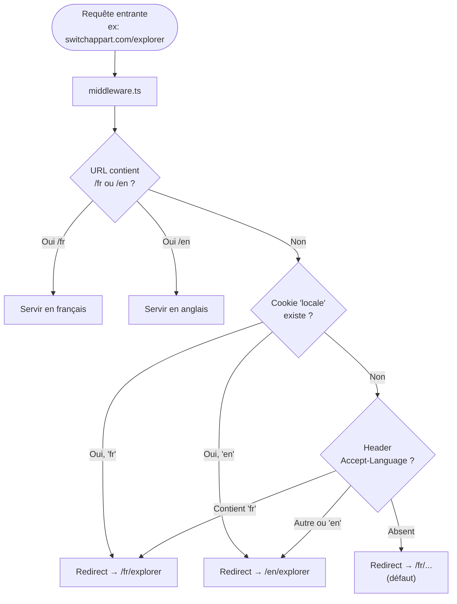
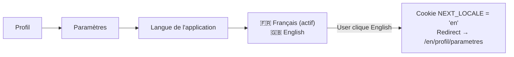

# i18n — Plan d'internationalisation

> **Date :** 30 mars 2026
> **Auteur :** Abderrazaq
> **Statut :** Plan — en attente de validation
> **Langues initiales :** Français (fr), Anglais (en)
> **Scope :** Frontend uniquement (le backend renvoie des codes d'erreur, pas du texte localisé)

---

## 1. Objectifs

1. **URL localisée** : `/fr/explorer`, `/en/explorer` — chaque langue a son propre chemin
2. **Détection automatique** de la langue du navigateur au premier accès
3. **Changement de langue** depuis les paramètres utilisateur
4. **SEO compliant** : `hreflang`, `<html lang>`, sitemap multi-langue, meta alternate
5. **Scalable** : ajouter une langue = ajouter un fichier JSON, rien d'autre
6. **Pas de flash** : la bonne langue est servie dès le premier rendu (SSR)

---

## 2. Stack technique

### 2.1 Librairie choisie : `next-intl`

| Critère | `next-intl` | `react-i18next` | `next-i18next` |
|---|---|---|---|
| Support App Router | ✅ Natif | ⚠️ Adapteur | ❌ Pages Router |
| SSR / RSC (Server Components) | ✅ | ⚠️ Partiel | ❌ |
| Middleware locale detection | ✅ Built-in | ❌ Manuel | ✅ Mais Pages Router |
| Format ICU (pluriels, genre, etc.) | ✅ | ✅ | ✅ |
| Taille bundle | Petit | Moyen | Gros |
| Maturité App Router | ✅ Référence | ⚠️ | ❌ Deprecated |

**`next-intl`** est le standard pour Next.js App Router. Tout le reste est soit conçu pour Pages Router, soit demande des hacks pour fonctionner avec les Server Components.

### 2.2 Dépendances

```bash
npm install next-intl
```

C'est tout. `next-intl` inclut :
- Le middleware de détection
- Le provider pour les Client Components
- Les hooks (`useTranslations`, `useLocale`, `useRouter`)
- Le support Server Components (`getTranslations`)
- Le formateur de dates, nombres, devises

---

## 3. Architecture fichiers

### 3.1 Structure des traductions

```
frontend/
├── messages/
│   ├── fr.json                    # Toutes les traductions FR
│   └── en.json                    # Toutes les traductions EN
├── src/
│   ├── i18n/
│   │   ├── config.ts              # Locales supportées, locale par défaut
│   │   ├── request.ts             # getRequestConfig pour next-intl (SSR)
│   │   └── navigation.ts          # Link, redirect, useRouter localisés
│   ├── middleware.ts              # Détection langue + redirect
│   ├── app/
│   │   └── [locale]/              # ← TOUT le contenu app passe sous [locale]
│   │       ├── layout.tsx         # RootLayout avec NextIntlClientProvider
│   │       ├── explorer/
│   │       │   ├── page.tsx
│   │       │   ├── components/
│   │       │   └── ...
│   │       ├── swipe/
│   │       ├── messages/
│   │       ├── favoris/
│   │       ├── profil/
│   │       └── ...
│   └── ...
```

### 3.2 Structure d'un fichier de traduction

Les traductions sont organisées par **namespace** (= par page/feature) pour éviter un seul fichier monstre :

```json
// messages/fr.json
{
  "common": {
    "loading": "Chargement...",
    "error": "Une erreur est survenue",
    "retry": "Réessayer",
    "save": "Enregistrer",
    "cancel": "Annuler",
    "close": "Fermer",
    "next": "Continuer",
    "back": "Retour",
    "publish": "Publier",
    "draft": "Brouillon"
  },
  "nav": {
    "explorer": "Explorer",
    "favorites": "Favoris",
    "switch": "Switch",
    "messages": "Messages",
    "profile": "Profil"
  },
  "auth": {
    "login": "Connexion",
    "register": "Inscription",
    "loginTitle": "Bon retour !",
    "loginSubtitle": "Veuillez entrer vos informations",
    "registerTitle": "Créer un compte",
    "registerSubtitle": "Inscrivez-vous pour commencer",
    "email": "Adresse email",
    "password": "Mot de passe",
    "confirmPassword": "Confirmer le mot de passe",
    "fullName": "Nom complet",
    "submit": "Se connecter",
    "submitRegister": "Créer un compte",
    "noAccount": "Pas encore de compte ?",
    "hasAccount": "Déjà un compte ?",
    "socialSeparator": "Ou continuer avec",
    "passwordMismatch": "Les mots de passe ne correspondent pas.",
    "fillAllFields": "Veuillez remplir tous les champs."
  },
  "explorer": {
    "searchPlaceholder": "Rechercher une ville, un quartier...",
    "featured": "Coups de cœur",
    "featuredSub": "Les plus populaires",
    "newest": "Nouveautés",
    "newestSub": "Récemment ajoutés",
    "allProperties": "Tous les logements",
    "inCity": "À {city}",
    "propertyCount": "{count, plural, one {# logement} other {# logements}}",
    "startSearch": "Commencer ma recherche",
    "filters": "Filtres",
    "map": "Carte",
    "list": "Liste"
  },
  "property": {
    "perMonth": "/mois",
    "rooms": "{count, plural, one {# pièce} other {# pièces}}",
    "bedrooms": "{count, plural, one {# chambre} other {# chambres}}",
    "bathrooms": "{count, plural, one {# salle de bain} other {# salles de bain}}",
    "surface": "{area} m²",
    "furnished": "Meublé",
    "petsAllowed": "Animaux acceptés",
    "smokingAllowed": "Fumeur autorisé",
    "utilitiesIncluded": "Charges comprises",
    "availableFrom": "Disponible dès le {date}",
    "deposit": "Dépôt : {amount} €",
    "contact": "Contacter",
    "favorite": "Favoris",
    "share": "Partager",
    "description": "Description",
    "amenities": "Équipements",
    "owner": "Le propriétaire",
    "compatibility": "Compatibilité",
    "dpe": "DPE",
    "ges": "GES"
  },
  "listing": {
    "botWelcome": "Salut ! Je vais vous aider à décrire votre logement en quelques questions. Ça prend moins de 2 minutes !",
    "questionType": "Quel type de logement proposez-vous ?",
    "questionAddress": "Où se trouve votre logement ?",
    "questionSurface": "Quelle surface et combien de pièces ?",
    "questionRent": "Quel loyer mensuel ?",
    "questionPhotos": "Montrez-nous votre logement !",
    "photosHint": "Les photos font toute la différence pour trouver votre Switch.",
    "ready": "Votre logement est prêt !",
    "readyHint": "Vous pouvez publier maintenant ou ajouter des détails pour booster votre compatibilité.",
    "publishButton": "Publier mon logement",
    "addDetails": "Ajouter des détails",
    "saveDraft": "Sauvegarder le brouillon",
    "addressPlaceholder": "Tapez une adresse...",
    "addressFallback": "Pas d'adresse précise ?",
    "addressFallbackLink": "Saisir juste la ville",
    "addressManual": "Saisir manuellement",
    "surfaceLabel": "Surface",
    "roomsLabel": "Pièces",
    "rentPlaceholder": "ex : 1 200",
    "photosUpload": "Ajouter des photos",
    "photosCover": "Couverture",
    "typeApartment": "Appartement",
    "typeHouse": "Maison",
    "typeStudio": "Studio",
    "typeLoft": "Loft",
    "typeRoom": "Chambre",
    "enrichTitle": "Complétez votre annonce",
    "enrichProgress": "Votre annonce est complète à {percent}%"
  },
  "swipe": {
    "like": "J'aime",
    "pass": "Passer",
    "superLike": "Super Like",
    "matchTitle": "C'est un Switch !",
    "matchSubtitle": "Vous avez matché avec {name}",
    "sendMessage": "Envoyer un message",
    "keepSwiping": "Continuer à swiper",
    "noMoreCards": "Plus de logements à découvrir",
    "noMoreHint": "Revenez plus tard ou élargissez vos filtres"
  },
  "profile": {
    "myProfile": "Mon profil",
    "myProperty": "Mon logement",
    "describeProperty": "Décrire mon logement",
    "resumeDraft": "Reprendre ma description",
    "settings": "Paramètres",
    "language": "Langue",
    "notifications": "Notifications",
    "referral": "Parrainer un ami",
    "legal": "Juridique",
    "logout": "Se déconnecter",
    "switchPass": "SwitchPass",
    "verified": "Vérifié",
    "exchanges": "{count, plural, one {# échange} other {# échanges}}"
  },
  "settings": {
    "title": "Paramètres",
    "languageTitle": "Langue de l'application",
    "languageDescription": "Choisissez la langue d'affichage",
    "french": "Français",
    "english": "English"
  },
  "propose": {
    "title": "Décrivez votre logement",
    "subtitle": "Trouvez votre Switch idéal en décrivant votre appartement actuel.",
    "cta": "Décrire mon logement",
    "later": "Plus tard"
  },
  "meta": {
    "homeTitle": "SwitchAppart — Échangez votre logement",
    "homeDescription": "Plateforme d'échange d'appartements entre particuliers. Trouvez votre Switch sans frais d'agence.",
    "explorerTitle": "Explorer les logements — SwitchAppart",
    "explorerDescription": "Découvrez des appartements disponibles à l'échange dans toute la France et en Europe.",
    "swipeTitle": "Swiper — SwitchAppart",
    "profileTitle": "Mon profil — SwitchAppart"
  }
}
```

```json
// messages/en.json
{
  "common": {
    "loading": "Loading...",
    "error": "Something went wrong",
    "retry": "Retry",
    "save": "Save",
    "cancel": "Cancel",
    "close": "Close",
    "next": "Continue",
    "back": "Back",
    "publish": "Publish",
    "draft": "Draft"
  },
  "nav": {
    "explorer": "Explore",
    "favorites": "Favorites",
    "switch": "Switch",
    "messages": "Messages",
    "profile": "Profile"
  },
  "auth": {
    "login": "Sign in",
    "register": "Sign up",
    "loginTitle": "Welcome back!",
    "loginSubtitle": "Please enter your credentials",
    "registerTitle": "Create an account",
    "registerSubtitle": "Sign up to get started",
    "email": "Email address",
    "password": "Password",
    "confirmPassword": "Confirm password",
    "fullName": "Full name",
    "submit": "Sign in",
    "submitRegister": "Create account",
    "noAccount": "Don't have an account?",
    "hasAccount": "Already have an account?",
    "socialSeparator": "Or continue with",
    "passwordMismatch": "Passwords don't match.",
    "fillAllFields": "Please fill in all fields."
  },
  "explorer": {
    "searchPlaceholder": "Search a city, a neighborhood...",
    "featured": "Favorites",
    "featuredSub": "Most popular",
    "newest": "New listings",
    "newestSub": "Recently added",
    "allProperties": "All properties",
    "inCity": "In {city}",
    "propertyCount": "{count, plural, one {# property} other {# properties}}",
    "startSearch": "Start searching",
    "filters": "Filters",
    "map": "Map",
    "list": "List"
  },
  "property": {
    "perMonth": "/month",
    "rooms": "{count, plural, one {# room} other {# rooms}}",
    "bedrooms": "{count, plural, one {# bedroom} other {# bedrooms}}",
    "bathrooms": "{count, plural, one {# bathroom} other {# bathrooms}}",
    "surface": "{area} m²",
    "furnished": "Furnished",
    "petsAllowed": "Pets allowed",
    "smokingAllowed": "Smoking allowed",
    "utilitiesIncluded": "Utilities included",
    "availableFrom": "Available from {date}",
    "deposit": "Deposit: {amount} €",
    "contact": "Contact",
    "favorite": "Favorite",
    "share": "Share",
    "description": "Description",
    "amenities": "Amenities",
    "owner": "The owner",
    "compatibility": "Compatibility",
    "dpe": "Energy rating",
    "ges": "Carbon rating"
  },
  "listing": {
    "botWelcome": "Hi! I'll help you describe your apartment in just a few questions. It takes less than 2 minutes!",
    "questionType": "What type of property are you offering?",
    "questionAddress": "Where is your property located?",
    "questionSurface": "What's the surface area and how many rooms?",
    "questionRent": "What's the monthly rent?",
    "questionPhotos": "Show us your place!",
    "photosHint": "Photos make all the difference when finding your Switch.",
    "ready": "Your property is ready!",
    "readyHint": "You can publish now or add more details to boost your compatibility score.",
    "publishButton": "Publish my property",
    "addDetails": "Add more details",
    "saveDraft": "Save as draft",
    "addressPlaceholder": "Type an address...",
    "addressFallback": "No exact address?",
    "addressFallbackLink": "Enter just the city",
    "addressManual": "Enter manually",
    "surfaceLabel": "Surface area",
    "roomsLabel": "Rooms",
    "rentPlaceholder": "e.g. 1,200",
    "photosUpload": "Add photos",
    "photosCover": "Cover",
    "typeApartment": "Apartment",
    "typeHouse": "House",
    "typeStudio": "Studio",
    "typeLoft": "Loft",
    "typeRoom": "Room",
    "enrichTitle": "Complete your listing",
    "enrichProgress": "Your listing is {percent}% complete"
  },
  "swipe": {
    "like": "Like",
    "pass": "Pass",
    "superLike": "Super Like",
    "matchTitle": "It's a Switch!",
    "matchSubtitle": "You matched with {name}",
    "sendMessage": "Send a message",
    "keepSwiping": "Keep swiping",
    "noMoreCards": "No more properties to discover",
    "noMoreHint": "Come back later or broaden your filters"
  },
  "profile": {
    "myProfile": "My profile",
    "myProperty": "My property",
    "describeProperty": "Describe my property",
    "resumeDraft": "Resume my listing",
    "settings": "Settings",
    "language": "Language",
    "notifications": "Notifications",
    "referral": "Refer a friend",
    "legal": "Legal",
    "logout": "Sign out",
    "switchPass": "SwitchPass",
    "verified": "Verified",
    "exchanges": "{count, plural, one {# exchange} other {# exchanges}}"
  },
  "settings": {
    "title": "Settings",
    "languageTitle": "App language",
    "languageDescription": "Choose your display language",
    "french": "Français",
    "english": "English"
  },
  "propose": {
    "title": "Describe your apartment",
    "subtitle": "Find your ideal Switch by describing your current apartment.",
    "cta": "Describe my property",
    "later": "Later"
  },
  "meta": {
    "homeTitle": "SwitchAppart — Exchange your apartment",
    "homeDescription": "Peer-to-peer apartment exchange platform. Find your Switch with zero agency fees.",
    "explorerTitle": "Explore properties — SwitchAppart",
    "explorerDescription": "Discover apartments available for exchange across France and Europe.",
    "swipeTitle": "Swipe — SwitchAppart",
    "profileTitle": "My profile — SwitchAppart"
  }
}
```

---

## 4. Détection automatique de la langue

### 4.1 Flow de détection



### 4.2 Ordre de priorité

1. **URL explicite** (`/fr/...` ou `/en/...`) → utiliser telle quelle
2. **Cookie `NEXT_LOCALE`** → l'user a déjà choisi sa langue, on la respecte
3. **Header `Accept-Language`** → langue du navigateur
4. **Défaut** → français (`fr`)

### 4.3 Middleware Next.js

```typescript
// frontend/src/middleware.ts
import createMiddleware from 'next-intl/middleware';
import { routing } from './i18n/routing';

export default createMiddleware(routing);

export const config = {
  matcher: [
    // Match toutes les routes sauf les fichiers statiques et API
    '/((?!api|_next|_vercel|.*\\..*).*)'
  ]
};
```

```typescript
// frontend/src/i18n/routing.ts
import { defineRouting } from 'next-intl/routing';

export const routing = defineRouting({
  locales: ['fr', 'en'],
  defaultLocale: 'fr',
  localeDetection: true,    // détection auto via Accept-Language
  localePrefix: 'always',   // /fr/... et /en/... toujours dans l'URL
});
```

```typescript
// frontend/src/i18n/navigation.ts
import { createNavigation } from 'next-intl/navigation';
import { routing } from './routing';

// Remplacements pour Link, redirect, useRouter, usePathname
// qui gèrent automatiquement le préfixe locale
export const { Link, redirect, usePathname, useRouter } = createNavigation(routing);
```

---

## 5. SEO

### 5.1 `<html lang>`

Le `layout.tsx` racine sous `[locale]` set la langue automatiquement :

```typescript
// frontend/src/app/[locale]/layout.tsx
export default function LocaleLayout({
  children,
  params: { locale }
}: {
  children: React.ReactNode;
  params: { locale: string };
}) {
  return (
    <html lang={locale}>
      <body>{children}</body>
    </html>
  );
}
```

### 5.2 Balises `hreflang` (alternate)

Dans chaque page, on génère les balises alternate pour indiquer à Google les versions dans les autres langues :

```html
<head>
  <link rel="alternate" hreflang="fr" href="https://switchappart.com/fr/explorer" />
  <link rel="alternate" hreflang="en" href="https://switchappart.com/en/explorer" />
  <link rel="alternate" hreflang="x-default" href="https://switchappart.com/fr/explorer" />
</head>
```

Avec `next-intl`, ça se fait via `generateMetadata` :

```typescript
// Dans chaque page.tsx
import { getTranslations } from 'next-intl/server';

export async function generateMetadata({ params: { locale } }: { params: { locale: string } }) {
  const t = await getTranslations({ locale, namespace: 'meta' });
  
  return {
    title: t('explorerTitle'),
    description: t('explorerDescription'),
    alternates: {
      canonical: `https://switchappart.com/${locale}/explorer`,
      languages: {
        'fr': 'https://switchappart.com/fr/explorer',
        'en': 'https://switchappart.com/en/explorer',
        'x-default': 'https://switchappart.com/fr/explorer',
      },
    },
  };
}
```

### 5.3 Sitemap multi-langue

```typescript
// frontend/src/app/sitemap.ts
const LOCALES = ['fr', 'en'];
const BASE_URL = 'https://switchappart.com';

const ROUTES = [
  '/explorer',
  '/swipe',
  '/favoris',
  '/profil',
];

export default function sitemap() {
  const entries = [];
  
  for (const route of ROUTES) {
    entries.push({
      url: `${BASE_URL}/fr${route}`,
      lastModified: new Date(),
      alternates: {
        languages: Object.fromEntries(
          LOCALES.map(locale => [locale, `${BASE_URL}/${locale}${route}`])
        ),
      },
    });
  }
  
  return entries;
}
```

### 5.4 Open Graph localisé

```typescript
// Dans generateMetadata
openGraph: {
  locale: locale === 'fr' ? 'fr_FR' : 'en_US',
  alternateLocale: locale === 'fr' ? 'en_US' : 'fr_FR',
  title: t('explorerTitle'),
  description: t('explorerDescription'),
}
```

---

## 6. Changement de langue depuis les paramètres

### 6.1 Flow utilisateur



### 6.2 Composant LanguageSelector

```
┌─────────────────────────────────────┐
│  🌐 Langue de l'application        │
│                                     │
│  ┌─────────────────────────────┐    │
│  │ 🇫🇷  Français          ✓   │    │
│  ├─────────────────────────────┤    │
│  │ 🇬🇧  English               │    │
│  └─────────────────────────────┘    │
│                                     │
│  La page va se recharger dans       │
│  la langue choisie.                 │
└─────────────────────────────────────┘
```

**Comportement :**
1. User sélectionne une nouvelle langue
2. On set le cookie `NEXT_LOCALE` (persiste entre les sessions)
3. On redirige vers la même page dans la nouvelle locale (`/fr/profil/parametres` → `/en/profil/parametres`)
4. La page se recharge dans la nouvelle langue
5. Si l'user est connecté, on sauvegarde aussi sa préférence en base (`user_profiles.preferred_locale`) pour la retrouver sur d'autres appareils

### 6.3 Persistance de la préférence

| Moyen | Usage | Durée |
|---|---|---|
| Cookie `NEXT_LOCALE` | Détection côté middleware (SSR) | 1 an |
| `user_profiles.preferred_locale` | Sync cross-device (si connecté) | Permanent |
| `Accept-Language` header | Fallback premier accès | Session |

**Au login :** si l'user a un `preferred_locale` en base, on set le cookie `NEXT_LOCALE` et on redirige vers la bonne locale.

---

## 7. Migration des composants existants

### 7.1 Pattern de migration

**Avant (hardcodé) :**
```tsx
<h2>Connexion</h2>
<p>Bon retour, veuillez entrer vos informations</p>
```

**Après (i18n) :**
```tsx
// Client Component
const t = useTranslations('auth');
<h2>{t('loginTitle')}</h2>
<p>{t('loginSubtitle')}</p>
```

```tsx
// Server Component
const t = await getTranslations('auth');
<h2>{t('loginTitle')}</h2>
<p>{t('loginSubtitle')}</p>
```

### 7.2 Interpolation et pluriels (format ICU)

```tsx
// Interpolation
t('explorer.inCity', { city: 'Paris' })
// FR: "À Paris" / EN: "In Paris"

// Pluriels
t('property.rooms', { count: 3 })
// FR: "3 pièces" / EN: "3 rooms"

// Dates (formatage auto selon la locale)
const format = useFormatter();
format.dateTime(new Date('2026-04-01'), { dateStyle: 'long' })
// FR: "1 avril 2026" / EN: "April 1, 2026"

// Devises
format.number(1200, { style: 'currency', currency: 'EUR' })
// FR: "1 200,00 €" / EN: "€1,200.00"
```

### 7.3 Ordre de migration

La migration se fait composant par composant. Ordre de priorité :

| Priorité | Composant / Zone | Nb strings estimé |
|---|---|---|
| 1 | `BottomNav` + `Header` (navigation) | ~10 |
| 2 | `ConnectionModal` + sous-composants (auth) | ~15 |
| 3 | `ProposeModal` | ~5 |
| 4 | Explorer page + composants | ~25 |
| 5 | Property detail / modal | ~20 |
| 6 | Swipe page + composants | ~15 |
| 7 | Messages page | ~10 |
| 8 | Favoris page | ~5 |
| 9 | Profil + paramètres | ~20 |
| 10 | Listing chatbot (nouveau flow) | ~30 |
| 11 | Search modal + filtres | ~15 |
| **Total** | | **~170 strings** |

---

## 8. Structure du dossier app après migration

```
frontend/src/app/
├── [locale]/                         # ← Nouveau : tout passe sous [locale]
│   ├── layout.tsx                    # RootLayout avec NextIntlClientProvider + <html lang>
│   ├── page.tsx                      # Redirect /[locale] → /[locale]/explorer
│   ├── explorer/
│   │   ├── page.tsx
│   │   ├── [id]/page.tsx
│   │   ├── components/
│   │   ├── hooks/
│   │   ├── services/
│   │   └── types/
│   ├── swipe/
│   ├── messages/
│   ├── favoris/
│   ├── profil/
│   │   ├── page.tsx
│   │   ├── mon-logement/             # Ex /profil/hote → renommé
│   │   ├── parametres/
│   │   │   ├── page.tsx
│   │   │   └── components/
│   │   │       └── LanguageSelector.tsx  # ← Nouveau
│   │   └── ...
│   └── not-found.tsx
├── sitemap.ts                        # Sitemap multi-locale (hors [locale])
├── robots.ts                         # Robots.txt (hors [locale])
└── layout.tsx                        # Layout minimal (redirect vers [locale])
```

**Important :** Le `layout.tsx` racine (hors `[locale]`) ne rend rien directement. C'est `[locale]/layout.tsx` qui est le vrai root layout avec les providers.

---

## 9. Routes — Mapping des URLs

Les noms de routes restent en **anglais technique** dans l'URL (pas de traduction des paths). C'est le standard (Airbnb, Booking, Spotify font pareil).

| Route | FR | EN |
|---|---|---|
| Accueil/Explorer | `/fr/explorer` | `/en/explorer` |
| Détail logement | `/fr/explorer/abc-123` | `/en/explorer/abc-123` |
| Swipe | `/fr/swipe` | `/en/swipe` |
| Messages | `/fr/messages` | `/en/messages` |
| Favoris | `/fr/favoris` | `/en/favoris` |
| Profil | `/fr/profil` | `/en/profil` |
| Mon logement | `/fr/profil/mon-logement` | `/en/profil/mon-logement` |
| Paramètres | `/fr/profil/parametres` | `/en/profil/parametres` |

**Note :** On garde les paths en français (`favoris`, `profil`, `parametres`) car c'est l'identité de la marque et les URLs sont déjà indexées. Si on veut les traduire plus tard (`/en/profile`, `/en/favorites`), `next-intl` supporte les pathnames localisés.

---

## 10. Impact backend

### 10.1 Ce qui ne change PAS

- Les endpoints API restent identiques (`/api/v1/...`)
- Les codes d'erreur restent en anglais (`AUTH_INVALID_CREDENTIALS`)
- Les messages d'erreur client restent génériques et en anglais dans l'API
- Le frontend traduit les codes d'erreur côté client

### 10.2 Ce qui change

| Changement | Détails |
|---|---|
| `user_profiles.preferred_locale` | Nouveau champ optionnel (`String?`, default `null`) |
| `GET /api/v1/auth/me` | Retourne `preferred_locale` dans la réponse |
| `PUT /api/v1/users/me` | Accepte `preferred_locale` en input |

Migration Prisma :
```prisma
model UserProfile {
  // ... existant ...
  preferred_locale  String?   // 'fr', 'en', null = auto-detect
}
```

---

## 11. Tâches d'implémentation

### Phase 1 — Setup (bloquant, faire en premier)
1. `npm install next-intl` dans frontend
2. Créer `frontend/src/i18n/` (config, routing, navigation, request)
3. Créer `frontend/src/middleware.ts`
4. Créer `frontend/messages/fr.json` et `en.json` (structure initiale)
5. Déplacer tout `app/*` sous `app/[locale]/*`
6. Adapter `[locale]/layout.tsx` avec `NextIntlClientProvider` et `<html lang>`
7. Vérifier que l'app build et fonctionne avec `/fr/explorer`

### Phase 2 — Migration composants (peut être fait progressivement)
8. Migrer `BottomNav` + `Header` (navigation)
9. Migrer `ConnectionModal` + sous-composants
10. Migrer `ProposeModal`
11. Migrer Explorer page + composants
12. Migrer Property detail / modal
13. Migrer Swipe, Messages, Favoris, Profil

### Phase 3 — SEO
14. `generateMetadata` avec traductions sur chaque page
15. Balises `hreflang` alternate
16. Sitemap multi-locale
17. Open Graph localisé

### Phase 4 — Paramètres + persistance
18. `LanguageSelector` dans les paramètres
19. Cookie `NEXT_LOCALE` persisté
20. Champ `preferred_locale` en base (migration Prisma)
21. Sync au login (base → cookie → redirect)

### Phase 5 — Nouvelles fonctionnalités
22. Traduire le chatbot de création d'annonce
23. Ajouter d'autres langues (es, de, it, pt, nl...) — juste un fichier JSON par langue
